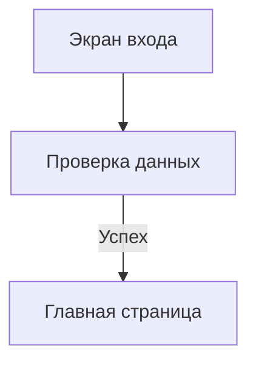

# Docgent

Docgent собирает проектную документацию из Markdown-файлов в обычный статический
сайт. Сайт можно открыть прямо с диска: сервер, база данных и npm для этого не
нужны.

Перед сборкой Docgent проверяет документы: находит битые ссылки, неверные ID,
ошибки в связях между сущностями и небезопасные пути. Результат подходит и для
чтения в браузере, и для автоматической проверки в CI.

## Первый запуск

Для сборки из исходного кода нужен Go 1.22 или новее.

В репозитории уже есть небольшая демонстрационная документация. Соберите из неё
сайт, чтобы посмотреть на результат:

```bash
go run ./cmd/docgent build ./example/docs \
  --output ./example/site \
  --clean \
  --open
```

Команду нужно запускать из корня клона Docgent. Она проверит файлы из
`example/docs`, создаст сайт в `example/site` и откроет его в браузере. Если
браузер не открылся автоматически, откройте `example/site/index.html` вручную.

Для интерактивного просмотра и редактирования исходной документации запустите:

```bash
make demo-serve
```

Команда поднимет пример на `http://127.0.0.1:8080`. В нём представлены
документы всех основных типов, раздельные каталоги пользовательских сценариев
и процессов, Mermaid, Screen Map, проигрываемые сценарии, hotspots,
traceability и рабочая задача. Статическая сборка в `example/site` доступна
через `make demo`.

Чтобы использовать Docgent в другом проекте, сначала соберите бинарник:

```bash
go build -o docgent ./cmd/docgent
```

Скопируйте `docgent` в удобное место или добавьте его каталог в `PATH`.

В своём проекте создайте `docs/index.md`:

```md
# Документация проекта

Здесь описано, как устроен проект и как с ним работать.
```

Также создайте обязательную карту `docs/architecture/overview.md`:

```md
# Архитектура проекта

- Тип документа: Architecture Overview

Проект принимает запросы пользователя и возвращает подтверждённый результат.

## Граница системы

Здесь кратко описана подтверждённая граница системы.

## Карта архитектурных вопросов
```

Теперь проверьте документы:

```bash
docgent check ./docs
```

Если структура документации корректна, команда завершится с кодом `0`. Ошибки и
предупреждения будут напечатаны с именами файлов и номерами строк.

После проверки соберите сайт:

```bash
docgent build ./docs --output ./build/project-docs --clean
```

В `build/project-docs` появится готовый портал. Откройте
`build/project-docs/index.html`; HTTP-сервер для просмотра не нужен.

Если в корне репозитория есть обычный читаемый `CHANGELOG.md`, портал также
создаёт `project-changelog.html` и вкладку «Журнал изменений проекта». Этот
журнал участвует в поиске портала, но не становится документом `docs/` и не
попадает в `report.json`.

### Встроенные темы и брендинг

Без настройки Docgent использует тему `classic`, системную светлую/тёмную
схему и встроенные fallback-ресурсы. Необязательный `.docgent/config.yml` в
корне репозитория выбирает темы `classic`, `paper` или `terminal`, accent,
плотность, ширину чтения, hero, footer, logo и favicon.

После сборки тему оформления и цветовую схему можно независимо выбирать из
выпадающих списков в правой части шапки. Оба выбора сохраняются локально в
браузере.

Пользовательские изображения хранятся только в `.docgent/assets/`. Docgent не
загружает CDN, custom CSS, внешние fonts или theme plugins, поэтому портал
остаётся автономным и работает через `file://`. Полный фиксированный
YAML-поднабор и пример приведены в
[справочнике конфигурации](docs/reference/configuration.md). Для стабильной
локализованной навигации задайте `project.locale` и все `project.sections`;
без них портал использует английские fallback-названия и сообщает warning.
Переводы выполняются отдельным workflow `$use-docgent translate`, а не новой
командой CLI: каждый locale живёт в собственном docs root и проходит обычный
strict `check`; canonical `docs/` остаётся источником task context.

### Документация самого Docgent

Чтобы собрать документацию этого репозитория, выполните из его корня:

```bash
go run ./cmd/docgent build ./docs \
  --output ./build/project-docs \
  --repository-root . \
  --clean
```

Готовый сайт появится в `build/project-docs`.

Если нужен локальный сервер, отдельная сборка не обязательна:

```bash
go run ./cmd/docgent serve ./docs \
  --output ./build/project-docs \
  --repository-root .
```

`serve` сначала соберёт сайт, а затем запустит его по адресу
`http://127.0.0.1:8080`. Кнопка редактора в хедере открывает live workspace с
деревом `.md`, `.yaml`, `.yml` и `.json`, preview Markdown, diagnostics и
созданием типизированных документов. Сохранение атомарно обновляет исходник,
модель, HTML и поиск; внешние изменения также замечает watcher. Ручная
пересборка остаётся доступной. Остановить сервер можно сочетанием `Ctrl+C`.

Результат `build` принципиально другой: это автономный read-only портал для
`file://`; editor UI, editor API и CodeMirror в него не попадают.

## Что должно быть в `docs`

Глобально требуются `index.md` и `architecture/overview.md`. Overview содержит
поле `Тип документа: Architecture Overview`, краткую границу системы и прямую
карту всех остальных Markdown-документов под `architecture/`. Каждый подробный
документ отвечает на один непустой `Архитектурный вопрос`, имеет тип
`Architecture` и перечисляется из overview напрямую, включая вложенные
каталоги.

Опциональный `quality/` содержит
стандарты `STD-*`, а `runbooks/` — реальные эксплуатационные процедуры `RB-*`;
для обоих появившихся разделов ожидается собственный `index.md`; его отсутствие
является warning и блокирует только `--strict`. Неизвестный
верхнеуровневый раздел можно объявить manifest-файлом `index.md` с
`Тип: Custom`, владельцем и описанием.

Минимальный проект содержит два файла:

```text
docs/
├── index.md
└── architecture/
    └── overview.md
```

По мере роста проекта можно добавить roadmap, риски, архитектуру, контракты,
решения, модули, сценарии, процессы, свободные заметки, идеи развития и рабочие
задачи:

```text
docs/
├── index.md
├── status.md
├── roadmap.md
├── risks.md
├── ideas.md
├── notes.md
├── architecture/
│   ├── overview.md
│   └── one-question.md
├── contracts/
├── decisions/
├── flows/
├── guides/
├── modules/
├── reference/
├── screens/
├── use-cases/
└── work/
```

Docgent распознаёт тип документа по его расположению и проверяет только те
правила, которые к нему относятся. Поэтому необязательно заводить всю структуру
сразу. Файлы `notes.md` и `ideas.md` не имеют обязательных полей или разделов:
в них можно свободно использовать заголовки, обычные и нумерованные списки,
выделение, ссылки, цитаты, таблицы и блоки кода.

## Диаграммы Mermaid

Docgent отображает стандартные блоки `mermaid` прямо в автономном портале:

````md

````

В первой версии разрешены `flowchart`, `stateDiagram-v2` и
`sequenceDiagram`. Один блок ограничен 50 000 байтами; Mermaid front matter и
директивы `%%{...}%%` запрещены. Библиотека встроена в бинарник и работает
через `file://` без CDN, Node.js и обязательного локального сервера.

`architecture/overview.md` оставляйте картой границы и вопросов. Каждый
подробный архитектурный документ должен давать короткий ответ на один вопрос и
ссылаться на соседние источники истины, не поглощая их содержимое.
Конкретные последовательности запросов и значимые межсервисные взаимодействия
описывайте в `flows/FLOW-*.md`: один `FLOW-*` представляет один значимый
сценарий, ветвление или обработку ошибок и содержит поле `Сценарий` со ссылкой
на `UC-*`. Не создавайте отдельный процесс для каждой простой операции — такие
детали остаются в API-контрактах. Диаграмма остаётся визуализацией: требования
определяют use cases, контракты и критерии приёмки.

## Процессы, карта экранов и проигрываемые сценарии

«Пользовательские сценарии» являются самостоятельным верхнеуровневым разделом
и каноническим домом `UC-*`. Раздел «Процессы» показывает документы `FLOW-*`:
бизнес-, технические, операционные и межмодульные процессы. Каталоги
`/use-cases/index.html` и `/processes/index.html` разделяют эти сущности.
Канонические страницы имеют стабильные URL `/use-cases/UC-*.html` и
`/flows/FLOW-*.html`; каталога `/flows/index.html` нет.

Страница `UC-*` объединяет четыре представления одной модели: описание, карту
затронутых экранов, пошаговое прохождение и связи. Один сценарий не получает
отдельную дублирующую страницу в `flows/`.

Документы `screens/SC-*.md` задают машинную модель экранов, состояний и
переходов. Docgent проверяет `SC-*`, `TR-*`, модули, маршруты и топологию, а
затем строит автономную SVG-карту, каталог и проигрываемые сценарии. Раздел
«Экраны» открывает каталог; при включённой карте она доступна отдельным пунктом.

```md
## Переходы

| ID | Сценарий | Действие | Условие | Результат |
|---|---|---|---|---|
| TR-AUTH-001 | UC-AUTH-01 | Продолжить | Успех | SC-ACCOUNT-DASHBOARD |
```

Use cases задают начальный и конечные экраны, задачи связывают `AC-*` с
`TR-*`, а необязательный `screens/hotspots.json` добавляет интерактивные зоны.
Карта поддерживает режимы по модулю, статусу, use case, незавершённым экранам
и sitemap; карточки показывают количество входящих и исходящих переходов.
Пошаговый режим хранит историю, отображает состояния и ошибки, а на terminal
screen позволяет начать заново, открыть карту или описание сценария.
Подробнее: [процессы](docs/guides/processes.md) и
[экранная модель](docs/guides/screens.md).

## Основные команды

```bash
docgent changes ./docs
docgent changes ./docs --base main --target working-tree --format json
docgent changes ./docs --branch-base main --format markdown
docgent task changes TASK-ID ./docs --format json
```

`serve` добавляет read-only раздел `/changes/`. Git остаётся источником версий;
Docgent не выполняет fetch, add, commit, checkout или другие изменения
репозитория. Source, rendered и deterministic semantic diff описаны в
[руководстве](docs/guides/documentation-changes.md).

Проверить документацию, не создавая сайт:

```bash
docgent check ./docs
docgent check ./docs --strict
docgent check ./docs --format json
```

В обычном режиме команда завершается с ошибкой только при серьёзных проблемах.
С `--strict` предупреждения тоже дают ненулевой код завершения.

Собрать сайт:

```bash
docgent build ./docs --output ./build/project-docs --clean
```

Запустить локальный сервер:

```bash
docgent serve ./docs
```

Он доступен по адресу `http://127.0.0.1:8080`. Через кнопку «Редактор
документации» можно открыть исходный документ, сохранить его с защитой от
конфликта digest или создать документ из того же реестра шаблонов, который
используют `task init` и `scaffold`. Для просмотра с другого
устройства в локальной сети запустите:

```bash
docgent serve ./docs --host 0.0.0.0 --port 8080
```

У сервера нет авторизации и TLS, поэтому не выставляйте его в публичную сеть.
При `--host 0.0.0.0` любой прямой клиент доступной локальной сети входит в
доверенную границу и может обращаться к editor API; same-origin browser guards
не заменяют аутентификацию. Editor и ручная пересборка существуют только в
`serve` и отсутствуют через `file://` или другой статический HTTP-сервер.

Полную справку по параметрам можно получить командой:

```bash
docgent --help
```

## Работа с задачами

Docgent умеет хранить рабочие элементы рядом с остальной документацией. Каждый
элемент лежит в отдельном файле `docs/work/*.md`: баги используют `BUG-*`,
остальные типы — `TASK-*`. В файле записано:

- какой результат нужен;
- какие файлы разрешено менять;
- что не входит в задачу;
- по каким критериям принимать работу;
- какими командами проверить каждый критерий;
- какие полные проверки проекта и документации нужно запустить.

### Статусы задач

| Статус | Что означает | Что требует Docgent |
|---|---|---|
| `Черновик` | Задача ещё уточняется | Корректные тип и статус, непустой `Результат` |
| `Готово к работе` | Задачу можно брать в работу | Полное описание, критерии и команды `AC-*` |
| `В работе` | Изменения выполняются | Те же требования, что для готовой задачи |
| `Заблокировано` | Продолжить работу сейчас нельзя | Дополнительный раздел `Блокер` |
| `Выполнено` | Работа завершена и проверена | Все критерии `[x]`, проверки `ALL` и `DOCS`, завершённые зависимости |
| `Отменено` | Работа больше не нужна | Дополнительный раздел `Причина отмены` |

Также принимаются английские значения `draft`, `ready`, `in progress`,
`blocked`, `done`/`completed` и `cancelled`/`canceled`.

### Типы задач

Тип отвечает на вопрос «что меняется», а статус — «на каком этапе находится
работа».

| Тип | Когда использовать | Нужен `Сценарий` |
|---|---|---|
| `Feature` | Новая или изменённая пользовательская возможность | Да |
| `Bug` | Исправление пользовательской ошибки | Да |
| `Maintenance` | Рефакторинг, инфраструктура или обслуживание | Нет |
| `Documentation` | Изменение документации | Нет |
| `Research` | Исследование или проверка гипотезы | Нет |

Для технической задачи без поля `Сценарий` нужен раздел
`Обоснование отсутствия сценария`. В Markdown тип можно написать и по-русски:
`Функциональность`, `Ошибка`, `Обслуживание`, `Документация` или `Исследование`.
В JSON Docgent всегда возвращает стабильное английское значение.

`docgent task init --type Bug` создаёт `BUG-AREA-NNN`. Для бага дополнительно
обязательны серьёзность, приоритет, воспроизводимость, признак регрессии,
симптом, ожидаемое и фактическое поведение, воспроизведение или доказательства,
первопричина и регрессионная проверка. Полный контракт описан в
[`docs/guides/work-items.md`](docs/guides/work-items.md).

### Поля и разделы

В одном файле должна быть ровно одна задача с уникальным заголовком `TASK-*`.
Для черновика достаточно:

```md
# TASK-AUTH-014: Добавить восстановление пароля

- Статус: Черновик
- Тип: Feature

## Результат

Пользователь может запросить ссылку для восстановления пароля.
```

Начиная со статуса `Готово к работе`, нужно указать существующий `MOD-*` в поле
`Модуль` и заполнить разделы:

1. `Результат`;
2. `Область изменения`;
3. `Не входит в задачу`;
4. `Критерии приёмки`;
5. `План`;
6. `Проверка`;
7. `Влияние на документацию`.

`Приоритет`, `Владелец`, `Последнее обновление` и `Зависит от` необязательны.
Приоритет — свободная метка: Docgent не ограничивает набор значений.

Зависимости указываются ID других задач. Они должны существовать и не могут
образовывать цикл. Выполненная задача не может зависеть от незавершённой.

Пути в `Области изменения`, записанные в обратных кавычках, проверяются
относительно `--repository-root`: они должны существовать и не выходить за
пределы репозитория. Разрешены glob-шаблоны, если они находят хотя бы один путь.

Полный формат с примером описан в
[руководстве по рабочим задачам](docs/guides/work-items.md).

### Критерии и команды

Например, у задачи `TASK-DOCS-001` есть три критерия `AC-01`, `AC-02` и `AC-03`.
Раздел проверки связывает каждый критерий с командой:

```md
## Критерии приёмки

- [x] `AC-01` Документация проходит строгую проверку.
- [x] `AC-02` Документы связаны стабильными ID.
- [x] `AC-03` README ссылается на документацию проекта.

## Проверка

- `AC-01` → `docgent check ./docs --strict`
- `AC-02` → `go test ./... -run 'TestKnowledgeModel|TestMinimalDocumentationCheckAndBuild'`
- `AC-03` → `grep -q 'Проектная документация Docgent' README.md`
- `ALL` → `go test ./...`
- `DOCS` → `docgent check ./docs --strict`
```

`AC-*` — отдельные критерии приёмки. `ALL` — полная проверка проекта, а `DOCS` —
полная проверка документации. Для выполненной задачи обязательны `ALL` и `DOCS`,
а все критерии должны быть отмечены.

Чекбоксы разрешены в разделах `Критерии приёмки` и `План`. В плане они
показывают выполнение отдельных шагов. Каждый критерий должен начинаться с
уникального `AC-*`, а каждая строка раздела `Проверка` — ссылаться ровно на один
`AC-*`, `ALL` или `DOCS` и содержать команду.

### Подготовить и проверить контракт задачи

```bash
docgent search "task workflow" ./docs
docgent task init ./docs --area CLI --title "Новая команда" --type Feature
docgent task ready TASK-CLI-002 ./docs --format json
```

`search` читает свежие Markdown-файлы. `task init` и `scaffold` создают
нейтральные каркасы атомарно и никогда не перезаписывают существующие файлы.
`task ready` только проверяет полный контракт; статус меняет исполнитель.

### Архивировать завершённую задачу

```bash
docgent task archive TASK-CLI-002 ./docs --format json
docgent task restore TASK-CLI-002 ./docs --format json
```

`task archive` принимает только задачи `Выполнено` и `Отменено` без ошибок
контракта и перемещает один файл в `work/archive/YYYY/`. Год берётся из даты
выполнения команды; Markdown и статус не изменяются. `task restore` возвращает
файл в корень `work/`.

Перед перемещением Docgent проверяет безопасность путей и прямые Markdown-ссылки.
Если другой документ ссылается на файл задачи или относительная ссылка самой
задачи после перемещения указывала бы в другое место, операция блокируется и
выводит документы и строки. Связи через стабильные `TASK-ID` перемещению не
мешают.

Нумерация `task init` учитывает все задачи рекурсивно, включая архив, поэтому
освободившийся номер повторно не используется. В портале архив скрыт по
умолчанию из главной страницы и навигации, но доступен в каталоге `work/`,
глобальном поиске и JSON-отчёте.

### Посмотреть контекст задачи

```bash
docgent task context TASK-DOCS-001 ./docs
```

Команда доступна начиная с Ready и выводит полный локальный контекст:

- саму задачу с результатом, областью изменений и критериями;
- связанный модуль, сценарий и бизнес-правила;
- задачи, от которых она зависит, и задачи, которые зависят от неё;
- связанные документы и замечания валидатора.

Это операция только для чтения. Она не меняет файлы и не запускает команды из
раздела `Проверка`. Для передачи результата другому инструменту есть JSON:

```bash
docgent task context TASK-DOCS-001 ./docs --format json
```

### Спланировать и выполнить проверки задачи

```bash
docgent task verify TASK-DOCS-001 ./docs --dry-run
```

Сначала Docgent проверяет сам файл задачи: обязательные разделы, ID, ссылки,
зависимости и соответствие критериев командам. Если задача описана неправильно,
команды не запускаются.

Dry-run возвращает план со статусом `planned` и ничего не запускает. После
проверки плана явный `--run` запускает команды `AC-*`, `ALL` и `DOCS` из
корня репозитория. Одинаковые команды выполняются один раз. Ошибка одной команды
не мешает запустить остальные, поэтому итоговый отчёт показывает все найденные
проблемы, а не только первую.

`--run` разрешён только для Ready, In Progress, Blocked и Done. Для полного
Draft доступен только безопасный `--dry-run`.

Для каждой команды отчёт содержит результат, код завершения, длительность и
вывод. Общий результат имеет один из трёх статусов: `passed`, `failed` или
`blocked`. `task verify` завершается с кодом `0` для `planned` и `passed`.

JSON-отчёт можно одновременно вывести в консоль и сохранить в файл:

```bash
docgent task verify TASK-DOCS-001 ./docs --run \
  --format json \
  --report ./build/task-report.json \
  --timeout 10m
```

`--timeout` ограничивает время каждой отдельной команды. При превышении лимита
Docgent завершает всё созданное ею дерево процессов.

Команды в разделе `Проверка` — обычные команды ОС с правами текущего
пользователя. Запускайте `task verify --run` только в доверенном репозитории.
Обычные `check`, `build`, `serve`, `search`, `task ready`, `task context` и
`task verify --dry-run` эти команды никогда не выполняют.

## Что получается на выходе

Сборка создаёт автономный HTML-портал с навигацией, поиском, обратными ссылками,
полным каталогом процессов, Mermaid-диаграммами, картой экранов, пошаговыми
сценариями, traceability, тремя встроенными темами, трёхрежимной цветовой
схемой и печатной версией. Рядом сохраняется
`report.json` schema v1 с документами, проектной моделью, screens, transitions
и diagnostics. Его можно читать в CI или других инструментах.

Глобальный прогресс берётся из `roadmap.md`. Состояние пунктов `UC-*` определяется
связанными use case; для `CON-*` и `DLV-*` используются чекбоксы самого roadmap.

## Безопасность

Docgent экранирует HTML, блокирует опасные URL и не копирует активные HTML, SVG,
XML и JavaScript-ресурсы из документации. Символические ссылки при сканировании
игнорируются.

Mermaid запускается с `securityLevel: "strict"`; пользовательская конфигурация
диаграмм не может ослабить этот режим. Закреплённая версия и лицензия описаны в
[`THIRD_PARTY_NOTICES.md`](THIRD_PARTY_NOTICES.md).

Флаг `--clean` очищает только отдельный выходной каталог. Docgent откажется
удалять исходную документацию, её родительский каталог, корень файловой системы
или цель выходной символической ссылки.

## Документация проекта

[Проектная документация Docgent](docs/index.md) содержит подробное описание
форматов, правил валидации, CLI-контракта и внутреннего устройства:

- [полный каталог возможностей](docs/reference/features.md);
- [контракт CLI](docs/contracts/cli.md);
- [настройки и значения по умолчанию](docs/reference/configuration.md);
- [архитектура](docs/architecture/overview.md);
- [рабочие задачи](docs/guides/work-items.md);
- [проверка изменений](docs/guides/testing.md).

## Skill для AI-агентов

В каталоге [`skills/use-docgent`](skills/use-docgent) находится Codex-skill,
который помогает агенту создавать и обновлять документы, исправлять diagnostics
Docgent и безопасно работать с `TASK-*`.

Для локальной установки скопируйте каталог skill в `~/.codex/skills`:

```bash
mkdir -p ~/.codex/skills
cp -R ./skills/use-docgent ~/.codex/skills/
```

После установки skill можно вызвать явно:

```text
$use-docgent init
```

`init` существует только на уровне skill: он выполняет read-only preflight,
при необходимости создаёт минимальные `docs/index.md` и
`docs/architecture/overview.md`, а затем добавляет или обновляет ограниченный
управляемый блок в корневом `AGENTS.md`. Legacy-архитектура не мигрирует
автоматически: skill останавливается и показывает diagnostics. Обычные вызовы
skill не устанавливают project instructions автоматически; команды `docgent
init` в Go CLI нет.

После подключения используйте skill для конкретной работы:

```text
$use-docgent обнови документацию изменённого CLI-контракта
```

Для систематической сверки документации с кодом, тестами, контрактами,
конфигурацией и CI доступны два изменяющих workflow:

```text
$use-docgent refresh
$use-docgent refresh diff
```

Первый проверяет и обновляет всю исходную документацию. Второй начинает со
staged, unstaged и untracked изменений относительно текущего `HEAD`, затем
добавляет связанные ссылками, stable ID, task relationships и изменёнными
публичными интерфейсами документы. Если Git или `HEAD` недоступен, diff-режим
останавливается и предлагает полный refresh.

Оба workflow меняют только evidence-backed документацию: они не исправляют код
ради согласования с текстом, не обновляют даты без содержательного изменения и
не выполняют init. Доказуемые удаления, rename и stable-ID migration включают
обновление всех ссылок. Tracked portals пересобираются только после semantic и
structural gates. Команды `docgent refresh` в Go CLI нет.

Skill создаёт новый `TASK-*` не для каждого prompt, а только по явному
требованию либо для существенной работы, которой нужны устойчивые scope,
acceptance criteria, verification или передача между исполнителями.

## Разработка

```bash
make check
```

## Подготовка релиза 0.0.1

Локальная сборка не создаёт тег и не обращается к GitHub:

```bash
make release
(cd dist && sha256sum -c checksums.txt)
./dist/docgent-linux-amd64 version
```

Каталог `dist/` содержит пять бинарников, `LICENSE`, third-party notices,
лицензии встроенных browser assets и `checksums.txt`. Для публикации используется
тег `0.0.1` без префикса `v`; workflow отклоняет тег, который не совпадает с
выводом `docgent version`.

## Лицензия

MIT. См. [LICENSE](LICENSE).
