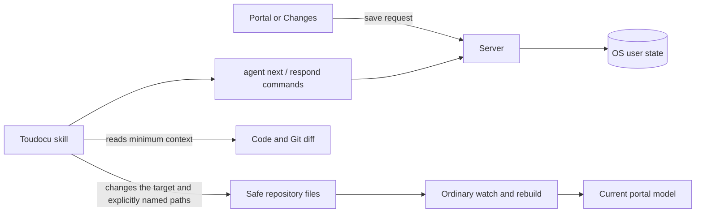

<!-- toudocu
version: 1
architectureQuestion: Как сообщение из локальной документации доставляется внешнему агенту разработки без прямой интеграции с ИИ?
-->

# Delivering a request to an external development agent

Toudocu separates conversation content from delivery. A `Discussion` contains
one logical thread, its message history, and a `DocumentAnchor`. Every saved
message creates a separate `AgentDelivery`, which an external agent retrieves
through a shared local state file. Neither the HTTP server nor a browser needs
to be running when the command is processed.

## Components and responsibilities

The server owns discussions, anchors, queue ordering, leases, responses, local
storage, and cleanup. It does not own Markdown parsing, Git history, source-file
writes, a language model, or an agent-provider integration.

## Atomic queue submission

During a save, the server holds one file lock while it validates the state
revision and anchor, moves the human message to `submitted`, assigns a
monotonic `sequence`, and adds a pending `AgentDelivery`. While the delivery is
`pending`, the message can be edited or deleted. Atomic retrieval through
`agent next` moves it to `claimed` and makes the message immutable. State is
written to a temporary file, synchronized, and atomically replaces the previous
file.

The queue belongs to one repository and is processed in strict arrival order.
`agent next` works only with the oldest unfinished delivery. An active lease
prevents a second handler from advancing to the next delivery; after the lease
expires, the same delivery can be retrieved again.
Every retrieved delivery requires `agent respond` before the next request or
exit. A successful response moves the delivery to `responded`; an open thread
is not returned to the queue by itself. A new human message creates a new
delivery.

## Target anchor

A `document` anchor stores the repository-relative path, checksum, Unicode character
range with one-based lines and columns, source text, and up to 2 KiB of context
on each side. Before returning a delivery, the server determines one state:

1. `current` — the checksum matches and the original range is valid;
2. `moved` — one exact match exists near the old lines, in the full document,
   or between the stored contexts;
3. `stale` — no unambiguous match exists;
4. `deleted` — the document or source fragment was removed.

The algorithm uses neither a language model nor fuzzy matching. Line numbers
are hints, not proof of the current location.

A `file` anchor can be created only for a regular file in a comparison against
the working tree. It uses the same range for available UTF-8 text up to 2 MiB.
A binary, large, or deleted file is stored as a whole-file target; its
disappearance does not prevent a response or a follow-up in an existing thread.

## Response and actual changes

The agent response is appended to history and is content-idempotent for its
`deliveryId`. `changedPaths` helps the interface open a result but does not
prove a change. The agent may change `target.path` and additional paths
explicitly named in the message when they remain within the target-kind safe
boundary. It does not expand the work to related documents, a changelog,
generated files, or neighboring code, and it does not run validation commands.
The watcher and rebuild reread the actual files independently of request
processing.

## Storage and recovery

The state root follows operating-system conventions, and the repository key is
derived from its canonical absolute root. The branch and `HEAD` are not part of
the identifier. Pending deliveries and open discussions are never removed
automatically. The user can delete any thread immediately, permanently removing
its messages and unfinished deliveries. Separately, a closed discussion with
no unfinished delivery can be removed automatically after 30 inactive days
during a later local-state mutation.

## Future extensions

A future interactive review would add `ReviewGate` with
`waiting|feedback|approved|cancelled` decisions. It would pass an existing
`AgentDelivery`; `Discussion`, messages, anchors, and responses would remain
unchanged. If a waiting agent disappears, the delivery remains in the
asynchronous queue. Blocking waits, confirmation, and agent hooks are outside
the current version.

## Related documents

- [MOD-AGENT-FEEDBACK](../modules/MOD-AGENT-FEEDBACK.md)
- [FLOW-AGENT-FEEDBACK](../flows/FLOW-AGENT-FEEDBACK.md)
- [Agent feedback JSON](../reference/agent-feedback-json.md)
