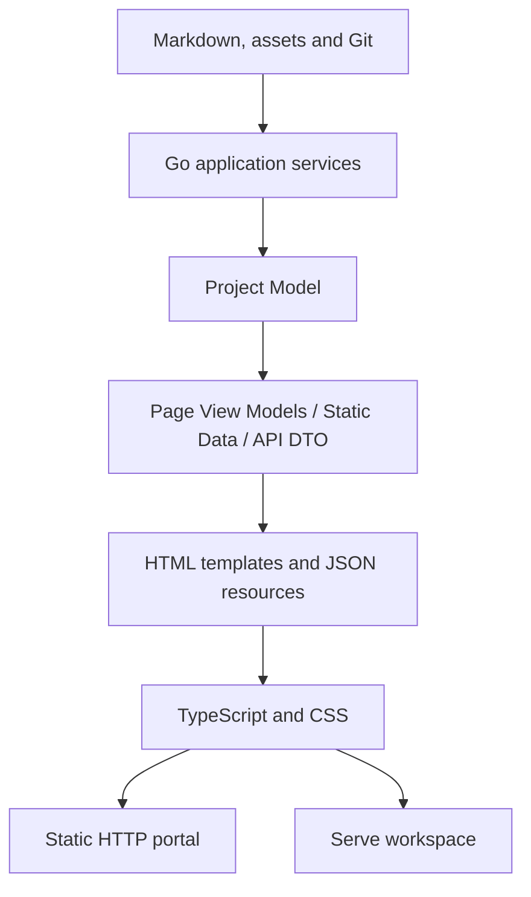

# Where Is the Boundary Between the Go Core and the Frontend Runtime?

- Document type: Architecture
- Architecture question: Where is the boundary between the Go core and the frontend runtime?

Go remains the sole source of the project model and the trusted boundary for
the filesystem, Git, and task verification. The frontend receives only a
prepared page representation, derived static data, and explicitly granted
runtime capabilities.

## Data flow

## Go responsibilities

Go reads and classifies documents, computes relationships, diagnostics,
readiness, and semantic diffs, normalizes paths, applies security guards, and
builds page view models, HTML, static JSON, and API DTOs. Bootstrap JSON is
serialized by the standard Go serializer and contains `schemaVersion`, runtime,
relative asset/data bases, a stable page type, and capabilities. Absolute
filesystem paths are not included.

## Frontend responsibilities

The frontend implements presentation and progressive enhancement: navigation,
search over the prepared index, preferences, tabs, dialogs, Mermaid, and the
editor and changes UI. The shared blocking `appearance.js` runs before the
first stylesheet, validates stored preferences individually, and applies server
defaults before the first frame. It does not parse Markdown, classify
documents, resolve relationships, compute readiness or diffs, or decide whether
a write is allowed.

Sources are located in `web/`, checked in TypeScript strict mode, and built with
esbuild. Derived assets are located in `internal/site/assets/generated/`, are
committed to the repository, and are embedded into the Go binary via
`go:embed`. Node.js is needed only by a developer changing the frontend; the
ready-made binary and an ordinary `go build ./...` do not depend on it.

## Runtime separation

`build` creates a multi-page read-only portal for HTTP(S) static hosting. It
contains the main `portal.js`, HTML content, and only its own relative
resources. The editor client, rebuild client, server API URL, and write
capability are absent.

`serve` uses the same renderer and `portal.js`, but Go explicitly adds
capabilities and separate `serve.js`, `editor.js`, and `changes.js` assets. The
API remains same-origin, and Go supplies the endpoint URLs. The `updateCheck`
capability allows the frontend to request only the server-computed version
endpoint; a response is accepted only with an official release URL, and a
dismissal is stored for the specific version. The frontend does not infer the
mode from the URL or incidental DOM markers.

Opening HTML directly via `file://` is not an architectural or product
contract. The existing `docu-docu serve` command provides a local browser
runtime; no new preview command is needed.

## Invariants

- The HTML of a regular page contains the main Markdown content before
  JavaScript starts.
- `appearance.js` is included in both the static and serve manifests and is
  placed before the first stylesheet in the portal, editor, and changes
  workspace.
- Typography roles `body`, `interface`, `heading`, and `mono` are defined by
  shared CSS tokens; CodeMirror and diff use `mono`, while the rendered document
  uses `body`.
- `build` does not depend on a running Go process after generation.
- Static JSON is a derived representation of one Go project model.
- The portal works at the host root and at a nested URL path without a required
  `baseURL`.
- The asset manifest is deterministic; filenames contain no timestamps or
  random data.
- A failure in one interactive component does not hide the main content.
- A failed or disabled version check does not change the main content or cause
  the browser to request an external origin.
- Browser input remains untrusted; Go makes all security decisions.

## Related documents

- [How do runtime components divide responsibilities?](runtime-components.md)
- [Where are the trust boundaries?](trust-boundaries.md)
- [MOD-SITE: Static portal](../modules/site.md)
- [UC-DOCS-01: Create a static HTTP portal](../use-cases/build-portal.md)
- [FLOW-DOCS-BUILD: Build a static HTTP portal](../flows/FLOW-DOCS-BUILD.md)
