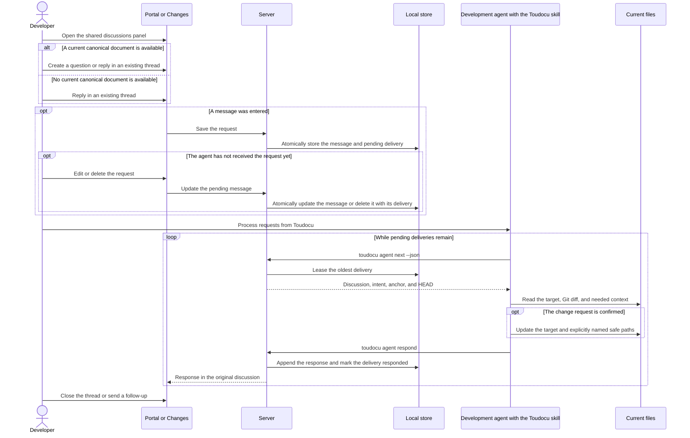

# FLOW-AGENT-FEEDBACK: Process the local documentation queue

- Identifier: FLOW-AGENT-FEEDBACK
- Scenario: UC-AGENT-FEEDBACK-01
- Module: MOD-AGENT-FEEDBACK
- Last updated: 2026-08-13

## Process

## Important conditions

- `question` never grants permission to change documentation.
- `change_request` requires validation of the user's claim.
- Every retrieved delivery is completed through `agent respond` before the next
  `agent next` call or the agent exits.
- An open discussion is not an unfinished delivery. After a response, only a
  new human message creates new work.
- The agent does not run validation commands or change related files on its own
  initiative. An additional path must be unambiguously named by the human and
  permitted by the target kind.
- A message can be edited only while its delivery is `pending`; retrieval through
  `agent next` and message updates are atomic with respect to each other.
- After a retry, the agent rereads the files because the previous attempt may
  have changed a document partially.
- An agent response does not close a discussion and is not a source of truth for
  the current documentation state.
- The panel shows every project thread on every page of the main `serve`, but a
  new thread can be created only when a current canonical document is available.
- An old line from a modified document is stored as a visible quote in the
  message with an ordinary document anchor; no new anchor type is introduced.

## Related documents

- [UC-AGENT-FEEDBACK-01](../use-cases/UC-AGENT-FEEDBACK-01.md)
- [Request delivery](../architecture/agent-feedback-delivery.md)
- [Agent feedback JSON](../reference/agent-feedback-json.md)
