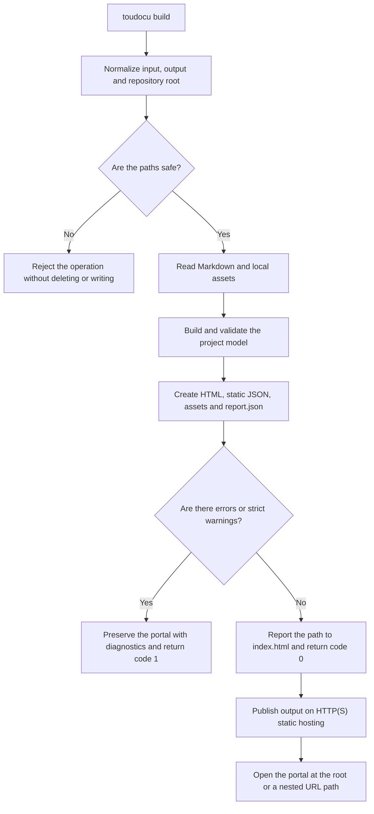

# FLOW-DOCS-BUILD: Building a Static HTTP Portal

- Identifier: FLOW-DOCS-BUILD
- Scenario: UC-DOCS-01
- Module: MOD-SITE
- Last updated: 2026-08-05

The diagram visualizes the pipeline of the `build` command. Result requirements,
exit codes, and safe cleanup are defined by
[UC-DOCS-01](../use-cases/build-portal.md), not by the diagram.

## Process

## Process boundaries

- An unsafe `--output` or `--clean` is blocked before any file is changed.
- Model errors remain available in the generated portal and `report.json`.
- Source Markdown is not modified.
- A Go backend is not required after the build; the frontend loads only its own
  relative resources from output.

## Related documents

- [UC-DOCS-01: Create a static HTTP portal](../use-cases/build-portal.md)
- [MOD-SITE: Static portal](../modules/site.md)
- [MOD-MODEL: Project model and validation](../modules/model.md)
- [CLI contract](../contracts/cli.md)
