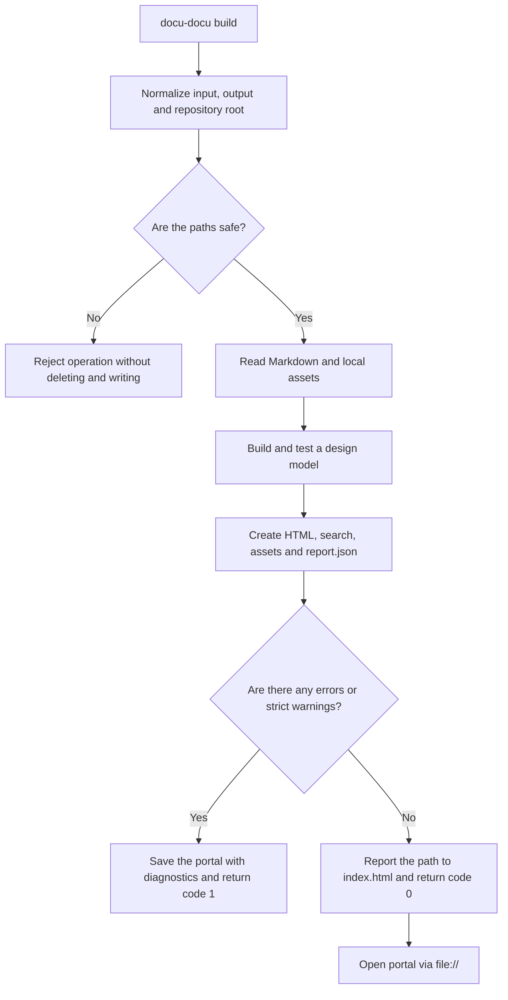

# FLOW-DOCS-BUILD: Building a standalone portal

- Identifier: FLOW-DOCS-BUILD
- Script: UC-DOCS-01
- Module: MOD-SITE
- Last updated: 2026-07-28

The diagram visualizes the pipeline of the `build` command. Result requirements, exit
codes and safe clearing defines
[UC-DOCS-01](../use-cases/build-portal.md), not a diagram.

## Process

## Process boundaries

- Unsafe `--output` or `--clean` is blocked until files are modified.
- Model errors remain available in the generated portal and `report.json`.
- The original Markdown is not modified.

## Related documents

- [UC-DOCS-01: Create an offline portal](../use-cases/build-portal.md)
- [MOD-SITE: Static portal](../modules/site.md)
- [MOD-MODEL: Design model and validation](../modules/model.md)
- [CLI contract](../contracts/cli.md)
