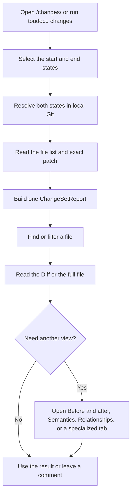

<!-- toudocu
id: FLOW-DOCS-CHANGES
module: MOD-CHANGES
useCase: UC-DOCS-05
updated: 2026-08-10
-->

# FLOW-DOCS-CHANGES: View documentation changes

The diagram shows how a selected Git range becomes a file list and a set of
readable views for each change.

## Process

The exact Git patch remains available even when Markdown, OpenAPI, Mermaid, or
another optional analyzer fails. No step changes Git.

## Related documents

- [UC-DOCS-05: View documentation changes](../use-cases/UC-DOCS-05.md)
- [MOD-CHANGES: Documentation changes](../modules/MOD-CHANGES.md)
- [How do Git states become change sets?](../architecture/documentation-changes.md)
