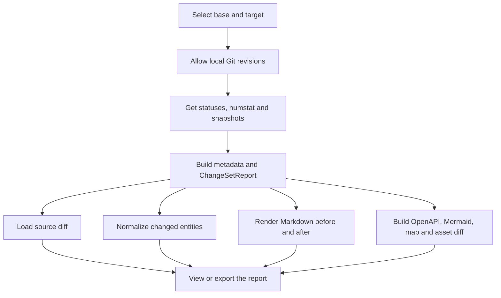

# FLOW-DOCS-CHANGES: Build and view documentation changes

- Identifier: FLOW-DOCS-CHANGES
- Script: UC-DOCS-05
- Module: MOD-CHANGES
- Last updated: 2026-07-31

Process shows path from explicitly selected Git range to lazy
representations of one deterministic change set.

## Process

## Related documents

- [UC-DOCS-05: View documentation changes](../use-cases/UC-DOCS-05.md)
- [MOD-CHANGES: Documentation changes](../modules/MOD-CHANGES.md)
- [How do Git states become change sets?](../architecture/documentation-changes.md)
