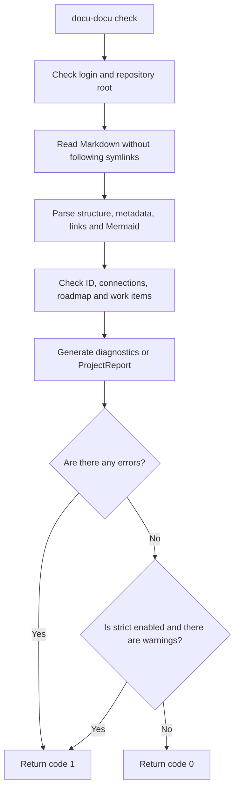

# FLOW-DOCS-CHECK: Documentation contract check

- Identifier: FLOW-DOCS-CHECK
- Script: UC-DOCS-02
- Module: MOD-MODEL
- Last updated: 2026-07-28

The diagram shows a read-only documentation check. Full set of rules and
determines the conditions for successful completion
[UC-DOCS-02](../use-cases/check-documentation.md).

## Process

## Process boundaries

- The team does not create the site and does not change the source documents.
- Commands from the `Проверка` sections of work tasks are not executed.
- In normal mode, warnings are included in the report, but do not change the successful exit
  code.

## Related documents

- [UC-DOCS-02: Check documentation](../use-cases/check-documentation.md)
- [MOD-MODEL: Design model and validation](../modules/model.md)
- [MOD-CLI: CLI and workflow tasks](../modules/cli.md)
- [Validation Rules](../guides/testing.md)
