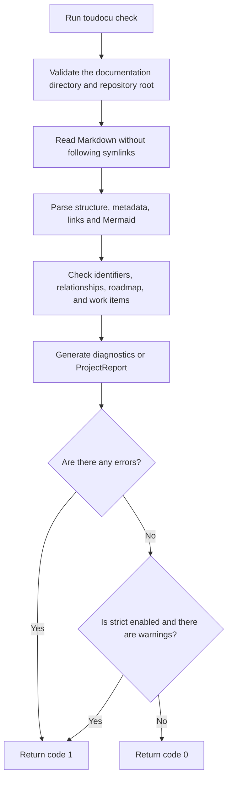

# FLOW-DOCS-CHECK: Documentation contract check

- Identifier: FLOW-DOCS-CHECK
- Use case: UC-DOCS-02
- Module: MOD-MODEL
- Last updated: 2026-08-10

`check` only reads documentation and reports problems. The complete rule set is
defined in [UC-DOCS-02](../use-cases/check-documentation.md).

## Process

## Important behavior

- The command does not build a portal or change source documents.
- Commands from a work item's Verification section are not executed.
- Without `--strict`, warnings appear in the report but do not change a
  successful exit code.

## Related documents

- [UC-DOCS-02: Check documentation](../use-cases/check-documentation.md)
- [MOD-MODEL: Design model and validation](../modules/model.md)
- [MOD-CLI: CLI and work-item operations](../modules/cli.md)
- [Validation rules](../guides/testing.md)
