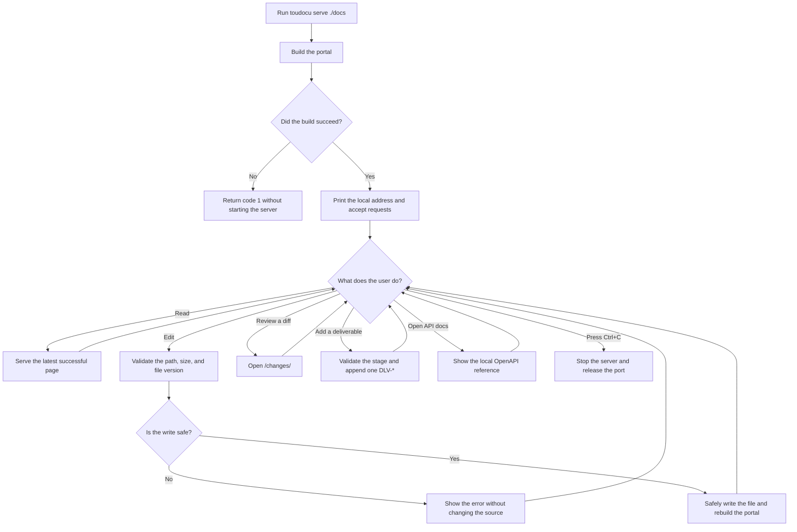

# FLOW-DOCS-SERVE: Work with the portal locally

- Identifier: FLOW-DOCS-SERVE
- Use case: UC-DOCS-03
- Module: MOD-SITE
- Last updated: 2026-08-10

The diagram shows the main `serve` lifecycle. Detailed errors and alternative
paths are described in [UC-DOCS-03](../use-cases/serve-portal.md).

## Flow

## What happens without an explicit browser action

- When an external editor changes a file, Toudocu waits for the contents to
  settle and rebuilds. If rebuilding fails, the server keeps its last working
  portal snapshot.
- Main HTML pages may navigate without a full reload. Editor, Changes, API,
  translations, and external links always use ordinary browser navigation.
- Search loads when first used; Mermaid loads when a diagram approaches the
  viewport.
- Configured translations rebuild independently and remain read-only.
- The main portal checks for a newer version at most once per process unless
  `--no-update-check` is set. Failure does not interrupt local work.

## Boundaries

- The server binds to `127.0.0.1` by default. `0.0.0.0` must be selected
  explicitly; there is no built-in TLS or authentication.
- The editor sees only allowed files inside the documentation root.
- Static `build` output contains no editor, local API, Changes workspace,
  polling, or manual rebuild controls.
- API docs use embedded assets and allow Try it out only for `GET` and `HEAD`.
- A rebuild failure does not stop an already running server.

## Related documents

- [UC-DOCS-03: View documentation on a local server](../use-cases/serve-portal.md)
- [FLOW-DOCS-BUILD: Build a static HTTP portal](FLOW-DOCS-BUILD.md)
- [MOD-SITE: Static portal](../modules/site.md)
- [CLI contract](../contracts/cli.md)
- [Editor HTTP API](../contracts/editor-http.md)
