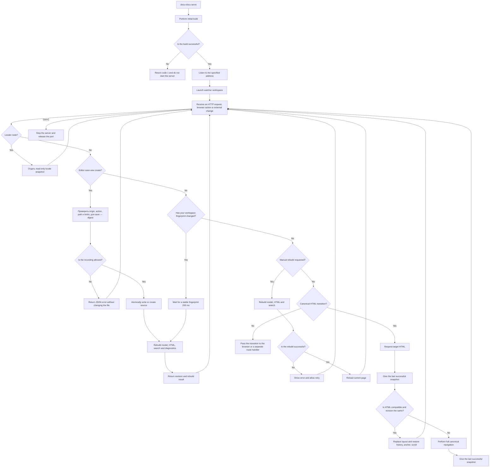

# FLOW-DOCS-SERVE: Local portal browsing

- Identifier: FLOW-DOCS-SERVE
- Script: UC-DOCS-03
- Module: MOD-SITE
- Last updated: 2026-08-04

The diagram visualizes the life cycle of the `serve` command. Network restrictions,
erroneous scenarios and postconditions are determined
[UC-DOCS-03](../use-cases/serve-portal.md).

## Process

## Process boundaries

- Regular routes distribute output; editor API is limited to workspace files inside
  docs root and does not provide access to the rest of the repository.
- The default is loopback; access via `0.0.0.0` is explicitly enabled.
- Manual rebuild updates the model, HTML and search, but does not close the listener or
  changes his address.
- HTTP navigation never triggers rebuild. With configured translations
  watcher rebuilds only the changed root; locale mount remains read-only
  and does not receive editor, changes or canonical API.
- Soft navigation only works between canonical HTML pages of the current one
  revision. Editor, changes, API, locale and external routes, as well as any failure
  checks use normal full load.
- Search index is loaded the first time you access the search, Mermaid - when
  bringing the diagram closer to the viewport; loaded runtimes are saved between
  soft transitions.
- Editor, CodeMirror, API, polling and manual rebuilding exist only in
  `serve`; the static portal via `file://` does not contain their markup or assets.
- A rebuild error does not stop an already running server.

## Related documents

- [UC-DOCS-03: View documentation on local server](../use-cases/serve-portal.md)
- [FLOW-DOCS-BUILD: Building a standalone portal](FLOW-DOCS-BUILD.md)
- [MOD-SITE: Static portal](../modules/site.md)
- [CLI contract](../contracts/cli.md)
- [HTTP contract editor API](../contracts/editor-http.md)
