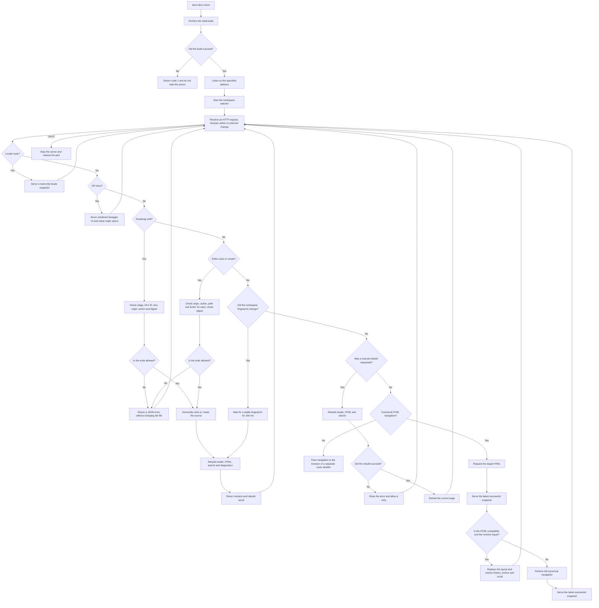

# FLOW-DOCS-SERVE: Viewing the Portal Locally

- Identifier: FLOW-DOCS-SERVE
- Scenario: UC-DOCS-03
- Module: MOD-SITE
- Last updated: 2026-08-06

The diagram visualizes the lifecycle of the `serve` command. Network
restrictions, error scenarios, and postconditions are defined by
[UC-DOCS-03](../use-cases/serve-portal.md).

## Process

## Process boundaries

- Ordinary routes serve output; the editor API is limited to workspace files
  inside docs root and provides no access to the rest of the repository.
- Loopback is used by default; access through `0.0.0.0` is enabled explicitly.
- A manual rebuild updates the model, HTML, and search but neither closes the
  listener nor changes its address.
- HTTP navigation never starts a rebuild. With configured translations, the
  watcher rebuilds only the root that changed; the locale mount remains
  read-only and receives no editor, changes, or canonical API.
- Soft navigation works only among canonical HTML pages of the current
  revision. Editor, changes, API, locale, and external routes, as well as any
  failed check, use an ordinary full load.
- The search index loads on first use of search, and Mermaid loads when a
  diagram approaches the viewport; loaded runtimes persist across soft
  navigations.
- Editor, CodeMirror, API, polling, and manual rebuild exist only in `serve`;
  static build contains none of their markup, endpoints, or assets.
- On the roadmap, canonical `serve` adds only a new unfinished `DLV-*` to an
  existing stage; a CAS conflict preserves the browser form and does not overwrite.
- API docs exist only in canonical `serve`, load no CDN, and allow Try it out
  only for `GET`/`HEAD`; static and locale portals do not contain them.
- A rebuild failure does not stop an already running server.

## Related documents

- [UC-DOCS-03: View documentation on a local server](../use-cases/serve-portal.md)
- [FLOW-DOCS-BUILD: Building a static HTTP portal](FLOW-DOCS-BUILD.md)
- [MOD-SITE: Static portal](../modules/site.md)
- [CLI contract](../contracts/cli.md)
- [Editor API HTTP contract](../contracts/editor-http.md)
