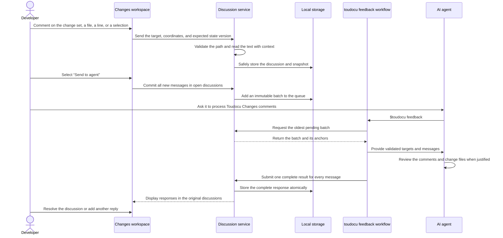

# FLOW-REVIEW-FEEDBACK: Hand comments to an agent

- Identifier: FLOW-REVIEW-FEEDBACK
- Use case: UC-REVIEW-01
- Module: MOD-REVIEW
- Last updated: 2026-08-10

## Flow

## Important behavior

- The browser does not provide selected text, context, or hashes; the server
  reads them itself.
- Repeated pending requests return the oldest batch until a complete response
  has been accepted.
- A response with a missing, duplicate, or invalid item changes no discussion.
- A `fixed` result does not resolve a discussion automatically.
- Neither the UI nor the CLI starts an agent or modifies Git.

## Related documents

- [UC-REVIEW-01](../use-cases/UC-REVIEW-01.md)
- [MOD-REVIEW](../modules/MOD-REVIEW.md)
- [Keeping comments attached](../architecture/review-anchoring.md)
- [CLI contract](../contracts/cli.md)
