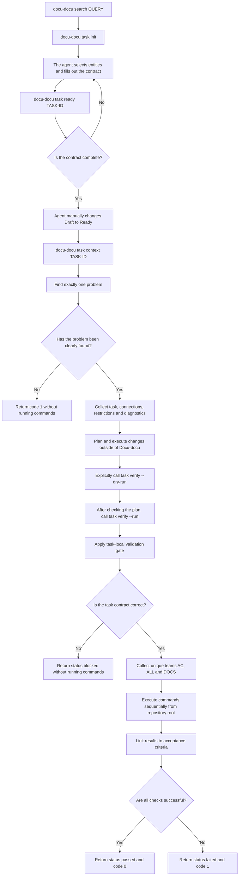

# FLOW-TASK-WORKFLOW: Working with the task being checked

- Identifier: FLOW-TASK-WORKFLOW
- Scenario: UC-TASK-01, UC-TASK-02, UC-TASK-03
- Module: MOD-CLI
- Last updated: 2026-07-28

The scheme links contract preparation, read-only context acquisition, and explicit
launching checks.

## Process

## Process boundaries

- `task context` never executes system commands.
- `task ready` never changes status or Markdown.
- `task verify --dry-run` never executes commands.
- `task verify --run` only runs explicitly trusted commands after
  local validation gate.
- Only the agent interprets the request, creates semantic connections and confirms
  criteria.
- An error in one command does not stop the others; timeout terminates the tree
  processes.

## Related documents

- [UC-TASK-01: Get work task context](../use-cases/task-workflow.md)
- [UC-TASK-02: Perform work task checks](../use-cases/task-verify.md)
- [UC-TASK-03: Prepare a new work task](../use-cases/UC-TASK-03.md)
- [MOD-CLI: CLI and workflow tasks](../modules/cli.md)
- [Work Task Guide](../guides/work-items.md)
- [CLI contract](../contracts/cli.md)
