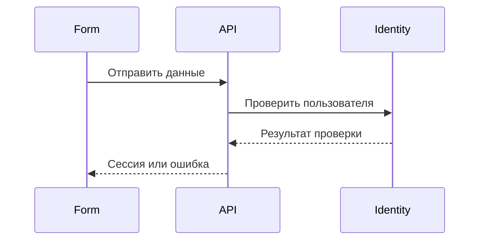

# Processes and use cases

"Use cases" and "Processes" are separate top-level sections for two related
but non-interchangeable entities:

| Entity | Answers the question | Source | Canonical page |
|---|---|---|---|
| `UC-*` | What does the actor obtain, and what are the requirements? | `use-cases/*.md` | `/use-cases/UC-*.html` |
| `FLOW-*` | How does a meaningful process or interaction work? | `flows/*.md` | `/flows/FLOW-*.html` |

`/use-cases/index.html` lists `UC-*`, while `/processes/index.html` lists
`FLOW-*`. Both catalogs support search and filters over their relationships.
`FLOW-*` documents are direct children of the "Processes" section without
intermediate groupings. `/flows/index.html` is not created.

## Use case

A use-case document defines requirements, actor, preconditions, main and
alternative scenarios, acceptance criteria, and start and terminal screens:

```md
# UC-AUTH-01: Вход пользователя

- Идентификатор: UC-AUTH-01
- Модуль: MOD-AUTH
- Начальный экран: SC-AUTH-LOGIN
- Конечные экраны: SC-ACCOUNT-DASHBOARD
- Статус: Реализован
```

The canonical `UC-*` HTML page is the scenario workspace and has four tabs:

1. "Description" — source Markdown, requirements, and criteria.
2. "Map" — only the reachable screens and transitions for the selected
   `UC-*`.
3. "Play" — a step-by-step viewer with actions, errors, back, and reset.
4. "Links" — module, `FLOW-*`, screens, tasks, code location, related
   contracts, and traceability rows.

The tab state is stored in the URL hash: `#overview`, `#map`, `#play`, or
`#links`. A link to the needed view can therefore be shared with another
participant without creating a separate page. The tabs support keyboard use.

## Visual process

A `FLOW-*` is a standalone named document with a Mermaid diagram. One document
describes one meaningful interaction: a self-contained scenario, inter-service
sequence, branch, or error handling. Simple operations and individual endpoints
remain in API contracts, so a `FLOW-*` is not needed for every request:

````md
# FLOW-AUTH-LOGIN: Проверка входа

- Идентификатор: FLOW-AUTH-LOGIN
- Модуль: MOD-AUTH
- Сценарий: UC-AUTH-01, UC-AUTH-02


````

The `Scenario` field supports multiple `UC-*` values. Toudocu builds both
sides of the relationship: a process shows related use cases, and each use case
shows related processes. Mermaid remains a representation; requirements and
criteria are not extracted from diagram text. Architecture documents retain the
overview of components, boundaries, and dependencies, while concrete request
sequences live in `flows/`.

## Screens section

"Screens" describes interface structure, not the complete list of processes.
It contains:

- the overall Screen Map and its modes;
- the `SC-*` catalog;
- screen, state, and `TR-*` transition pages;
- incoming and outgoing relationships, previews, and hotspots.

The map and playback for a specific scenario appear inside its `UC-*` page
because they belong to that process. The overall map remains under "Screens"
because it shows the entire interface topology independently of any one
scenario.

## Stable URLs and JSON

Source Markdown filenames do not define the public URL. When a safe stable ID
is present, Toudocu creates:

```text
/processes/index.html
/use-cases/index.html
/use-cases/UC-AUTH-01.html
/flows/FLOW-AUTH-LOGIN.html
/screens/SC-AUTH-LOGIN.html
```

A duplicate `/flows/UC-AUTH-01.html` page is not created. In schema v1,
`knowledge.flows[]` contains `useCaseIds`, while `knowledge.useCases[]`
contains `flowIds`. Screen branches remain in top-level `playableFlows[]`.

## Fault tolerance

A screen-graph error does not block the source use case or process catalog. A
diagnostic is shown in place of the map or playback. An error in one Mermaid
diagram shows its source without disrupting other pages. The entire interface
remains read-only and works on HTTP(S) static hosting without a Toudocu
backend.
