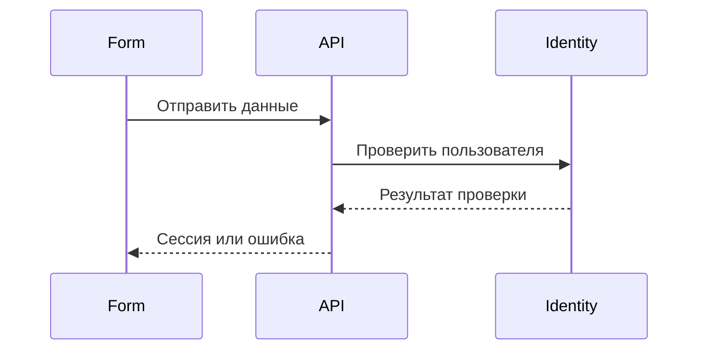

# Processes and user scripts

"User Scripts" and "Processes" are separate
top-level sections for two related but not interchangeable
entities:

| Entity | Answers the question | Source | Canonical page |
|---|---|---|---|
| `UC-*` | What does the actor get and what are the requirements? | `use-cases/*.md` | `/use-cases/UC-*.html` |
| `FLOW-*` | How does a meaningful process or interaction work? | `flows/*.md` | `/flows/FLOW-*.html` |

`/use-cases/index.html` enumerates `UC-*` and `/processes/index.html` enumerates
`FLOW-*`. Both directories support searching and filtering by their links. Documents
`FLOW-*` are direct children of the Processes section without
intermediate groups. `/flows/index.html` is not created.

## Custom script

The use case document specifies the requirements, actor, preconditions, main and
alternative scenarios, acceptance criteria, start and end screens:

```md
# UC-AUTH-01: Вход пользователя

- Идентификатор: UC-AUTH-01
- Модуль: MOD-AUTH
- Начальный экран: SC-AUTH-LOGIN
- Конечные экраны: SC-ACCOUNT-DASHBOARD
- Статус: Реализован
```

The canonical HTML page `UC-*` is the script workspace and
has four tabs:

1. “Description” - original Markdown, requirements and criteria.
2. “Map” - only reachable screens and transitions of the selected `UC-*`.
3. “Play” - step-by-step viewer with actions, errors, back and reset.
4. “Connections” - module, `FLOW-*`, screens, tasks, location in code,
   associated contracts and traceability strings.

The tab state is stored in a hash URL: `#overview`, `#map`, `#play` or
`#links`. Therefore, the link to the desired view can be passed to another
participant without creating a separate page. Tabs work from the keyboard.

## Visual process

`FLOW-*` is a separate named document with a Mermaid diagram. One
the document describes one significant interaction: a stand-alone scenario,
inter-service consistency, branching or error handling. Simple
operations and individual endpoints remain in API contracts, so create
`FLOW-*` is not needed for every request:

````md
# FLOW-AUTH-LOGIN: Проверка входа

- Идентификатор: FLOW-AUTH-LOGIN
- Модуль: MOD-AUTH
- Сценарий: UC-AUTH-01, UC-AUTH-02


````

Поле `Сценарий` поддерживает несколько `UC-*`. Docu-docu строит обе стороны
связи: процесс показывает связанные сценарии, а каждый use case — связанные
процессы. Mermaid остаётся представлением; требования и критерии не извлекаются
из текста диаграммы. Архитектурные документы при этом сохраняют обзор
компонентов, границ и зависимостей, а конкретные запросы находятся в `flows/`.

## Раздел «Экраны»

«Экраны» отвечает за структуру интерфейса, а не за полный перечень процессов.
В нём находятся:

- общая Screen Map и её режимы;
- каталог `SC-*`;
- страницы экранов, состояний и переходов `TR-*`;
- входящие и исходящие связи, previews и hotspots.

Карта и проигрывание конкретного сценария отображаются внутри страницы
`UC-*`, потому что относятся к процессу. Общая карта остаётся в «Экранах»,
поскольку показывает всю топологию интерфейса независимо от одного сценария.

## Стабильные URL и JSON

Имена исходных Markdown-файлов не формируют публичный URL. При наличии
безопасного стабильного ID Docu-docu создаёт:

```text
/processes/index.html
/use-cases/index.html
/use-cases/UC-AUTH-01.html
/flows/FLOW-AUTH-LOGIN.html
/screens/SC-AUTH-LOGIN.html
```

A duplicate `/flows/UC-AUTH-01.html` page is not created. In schema v1
`knowledge.flows[]` contains `useCaseIds`, and `knowledge.useCases[]` contains
`flowIds`. Screen branches are still in top-level
`playableFlows[]`.

## Fault tolerance

The screen graph error does not block the original use case or process directory.
Diagnostic is displayed instead of map or playback. Individual error
Mermaid diagrams show the source code without disturbing the rest of the page.
The entire interface remains read-only and works through `file://`.