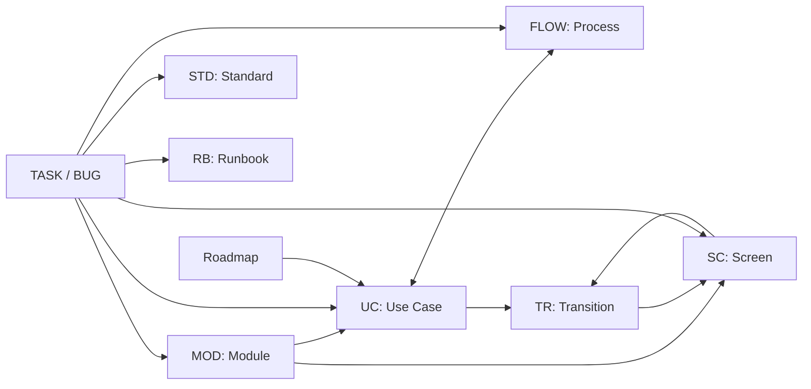

# Document and Relationship Model

This reference describes the machine-readable promises made by Markdown
documents: how paths determine document kinds, which identifiers and
relationships Docu-docu recognizes, and what the CLI validates. It helps an
author understand the structural contract before writing, but does not replace
semantic review.

Use ordinary Markdown when a document needs no stable ID, validated
relationship, or special representation. A file's location alone does not make
it useful, and a successful `check` does not prove that its prose is true.

## Validation boundary

Docu-docu validates only explicit promises:

| Signal | Promise | Validation |
|---|---|---|
| Ordinary Markdown | A safe, readable document | Markdown, local links, and basic editorial warnings |
| Reserved path | A special document kind | The contract for that kind |
| Stable ID | Durable entity identity | Format, uniqueness, and allowed location |
| ID field or local link | Explicit relationship | Existence and allowed target kind |
| Checkbox in `roadmap.md` | Global-scope item | Supported ID and derived state for `UC-*` |
| `task ready` | Complete task contract | Required fields, sections, relationships, and checks |
| `task verify --run` | Permission to execute commands | Task-local validation before execution |

Errors protect path safety, identity, relationship integrity, and executable
contracts. Warnings describe editorial completeness, unknown status, or
staleness. Never invent information merely to remove a warning.

## How document kind is determined

| Path | Kind and special behavior |
|---|---|
| `index.md` | Project home page, expected in every documentation root |
| `status.md` | Current snapshot; task checklists are rejected |
| `roadmap.md` | Global scope and aggregated progress |
| `risks.md` | Registry of `RISK-*` sections and mitigation progress |
| `ideas.md` | Free-form ideas with no required metadata contract |
| `notes.md` | Free-form notes with no required metadata contract |
| `modules/*.md` | `MOD-*` module with a boundary and rules |
| `use-cases/*.md` | `UC-*` user scenario |
| `flows/*.md` | `FLOW-*` visual process with Mermaid |
| `screens/SC-*.md` | `SC-*` screen, states, and `TR-*` transitions |
| `screens/index.md` | Screen-section entry page without an `SC-*` entity |
| `screens/hotspots.json` | Interactive areas for existing `SC-*` and `TR-*` |
| `decisions/*.md` | `ADR-*` architecture decision |
| `quality/STD-*.md` | Enforceable `STD-*` standard |
| `quality/index.md` | Quality-section entry page |
| `runbooks/RB-*.md` | `RB-*` operational procedure |
| `runbooks/index.md` | Runbook-section entry page |
| `work/TASK-*.md`, `work/BUG-*.md`, `work/archive/YYYY/*.md` | Active or archived work item under one task contract |
| `architecture/overview.md` | Required system boundary and architectural question map |
| Other `architecture/**/*.md` | Answer to one architectural question |
| `contracts/**/*.openapi.{yaml,yml,json}` | OpenAPI 3.0/3.1 source with separate structural validation |
| Other Markdown in `contracts/`, `guides/`, `reference/` | Contract, guide, or reference without a required entity ID |
| Repository-root `CHANGELOG.md` | The sole special release journal, when present |
| Any other path | Ordinary Markdown without a built-in typed contract |

An unknown top-level Markdown section declares its own `index.md` with
`Type: Custom`, an owner, a description, and a useful H1. This adds navigation,
not new built-in semantics. See [Document Types](document-types.md) for the
semantic boundaries between kinds.

## Identity

Stable IDs do not depend on a title or filename. Renaming must not change the
ID; a real identity change updates every reference together.

| Entity | ID format | Uniqueness scope |
|---|---|---|
| Module | `MOD-*` | Entire documentation root |
| Module business rule | `BR-*` | Entire documentation root |
| Use case | `UC-*` | Entire documentation root |
| Process | `FLOW-*` | Entire documentation root |
| Screen | `SC-<AREA>-<NAME>` | Entire documentation root |
| Transition | `TR-<AREA>-<NUMBER>` | Entire documentation root |
| Decision | `ADR-*` | Entire documentation root |
| Standard | `STD-*` | Entire documentation root |
| Runbook | `RB-*` | Entire documentation root |
| Task | `TASK-<AREA>-<NUMBER>` | Active and archived `work/**` together |
| Bug | `BUG-<AREA>-<NUMBER>` | Active and archived `work/**` together |
| Acceptance criterion | `AC-*` | One work item |

The same stable ID cannot be declared twice. Relative Markdown links must
resolve inside the repository root; a link is an explicit relationship even
when it does not participate in the typed model.

## Map of primary relationships

The diagram is a quick navigation aid. Cardinality and exceptions are defined
by the matrix and detailed sections below. The enclosing system boundary is
described in the [architecture overview](../architecture/overview.md).



## Typed relationship matrix

The reverse side states whether Docu-docu derives a backlink in the model and
portal; a derived reverse relationship needs no duplicate Markdown field.

| Source | Declaration | Target | Cardinality | Reverse side |
|---|---|---|---|---|
| `UC-*` | `Module` | `MOD-*` | Exactly one | Module lists related use cases |
| `UC-*` | `Start screen` | `SC-*` | Optional, at most one | Screen participates in the scenario model |
| `UC-*` | `Terminal screens` | `SC-*` | Optional list | Screens participate in the scenario model |
| `UC-*` | `Screens` | `SC-*` | Optional list | Screens enter the selected scenario |
| `FLOW-*` | `Scenario` | `UC-*` | One or more for a product flow | Each use case receives the flow |
| Architectural `FLOW-*` | Markdown link | Architecture document | Required when `Scenario` is absent | Ordinary backlink |
| `FLOW-*` | `Module` | `MOD-*` | Optional | Attribute/filter only; no reverse collection |
| `SC-*` | `Module` | `MOD-*` | Exactly one | Screen is available to module and use-case views |
| `SC-*` | `Parent screen` | `SC-*` | Optional, at most one | Derived child relationship |
| `TR-*` row | `Use case` | `UC-*` | Exactly one | Transition enters the use-case screen graph |
| `TR-*` row | `Result` | `SC-*` | Exactly one | Target receives an incoming transition |
| Ordinary `TASK-*` | `Module` | `MOD-*` | Required for non-Draft | Related task context |
| `BUG-*` | `Module` | `MOD-*` | Required in every status | Related task context |
| Ordinary `TASK-*` | `Use case` | `UC-*` | Required for non-Draft Feature; reasoned omission for other types | Related task context |
| `BUG-*` | `Use case` | `UC-*` | Required or explicitly `Not applicable` with user-behavior rationale | Related task context |
| Work item | `Flow` | `FLOW-*` | Optional, at most one | Included in task context |
| Work item | `Screens` | `SC-*` | Optional list | Included in task context |
| Work item | `Transitions` | `TR-*` | Optional list | Included in context and traceability |
| Work item | `Standards` | `STD-*` | Optional list | Documents become required reads |
| Work item | `Affected runbooks` | `RB-*` | Optional list | Documents become required reads |
| Work item | `Depends on` | `TASK-*` or `BUG-*` | Optional list | Dependency enters the task graph |
| `roadmap.md` | ID in a checklist item | `UC-*`, `CON-*`, or `DLV-*` | Exactly one supported ID per item | `UC-*` state comes from its use case |
| Architecture Overview | Direct Markdown link | Every other `architecture/**/*.md` | One or more per document | Detail is listed in overview |
| Superseded `STD-*` | `Superseded by` | `STD-*` | Exactly one when superseded | Standard replacement chain |

Multi-ID fields accept only existing targets of allowed kinds. An ordinary
Markdown link does not replace a required metadata field.

## Derived relationships and data

Docu-docu derives views only from canonical Markdown sources:

- `FLOW → UC` from `Scenario` automatically creates `UC → FLOW`.
- `TR-*` rows create incoming/outgoing transitions, the screen graph, and the
  playable flow for the selected `UC-*`.
- Parent-screen relationships create the Screen Map hierarchy.
- A roadmap `UC-*` gets state from its use case; `CON-*` and `DLV-*` retain
  their checkbox state.
- Links, IDs, and task metadata create backlinks, task context, and
  traceability.
- Mermaid nodes and edges are visualization only; diagram text creates no
  model relationships.

Generated HTML, `report.json`, the search index, and Screen Map are derived
outputs and are never edited as documentation sources.

## Graph constraints

### Architecture

`architecture/overview.md` links directly to every other Markdown file under
`architecture/`, including nested directories. Each detail declares type
`Architecture` and exactly one non-empty architectural question. A transitive
link through another document does not replace the overview entry.

### Screens and transitions

A screen references only existing `MOD-*`, `UC-*`, and `SC-*`. External
navigation targets an `SC-*` of type External page with an HTTP(S) route, not a
URL placed directly in a transition row. Routes are case-sensitive and unique.
Every `TR-*` has a unique ID, exactly one `UC-*`, a meaningful action, and a
target. A self-transition explains its state, error, or other observable result.

A use case with a screen model declares start and terminal screens. Graph
validation finds unreachable screens, dead ends, problematic cycles, and error
branches without exits. Fields, states, transition types, and hotspots are
defined in the [screen guide](../guides/screens.md).

### Work items

Work-item dependencies must exist and be acyclic. A task cannot be Done while
a dependency is incomplete. Active and archived work items share one ID and
dependency scope.

Every `AC-*` has exactly one verification entry. Ready+ requires targets for
each `AC-*`, `ALL`, and `DOCS`; explicitly linked standards also require
`QUALITY`. `AC → TR → verification` traceability supplements but never replaces
the criterion's executable command.

A non-Draft Feature references an existing `UC-*`. Maintenance,
Documentation, and Research may omit it only with an explanation. Every Bug
declares a module and use case; a technical Bug may use `Not applicable` only
with an explained relationship to user behavior. The complete contract is in
the [work-item guide](../guides/work-items.md).

## What is not a relationship

- An ID mentioned in ordinary prose or fenced code without a recognized field.
- A filename resembling an ID when the typed contract requires an explicit ID.
- A Mermaid edge.
- A repository path matching a standard's scope.
- A dependency inferred from code or directory structure.
- A generated backlink copied manually into a source document.

Docu-docu does not infer standard applicability from globs or create product
relationships from plausible coincidences. Meaningful relationships are
declared explicitly and supported by project content.

## Supported Markdown and safe paths

Supported constructs are CommonMark headings, paragraphs, emphasis, links,
safe raster images, blockquotes, lists, task lists, tables, strikethrough,
literal autolinks, inline code, and fenced code.

Raw HTML, completed leading front matter, attributes, footnotes, definition
lists, active SVG/XML/HTML assets, and JavaScript URLs are unsupported. Local
links and images must stay inside the repository root. Fenced code is not
parsed as headings, links, metadata, or tasks.

## Order for creating a connected model

Create a target before references to it: module and rules, then use case, then
flow or screens, and finally roadmap or work item. After changing an ID or
relationship, run:

```bash
go run ./cmd/docu-docu check ./docs --repository-root .
```

The check proves the structure and integrity of declared relationships.
Usefulness, truth, completeness, and correct relationship choices remain
subject to semantic review.
