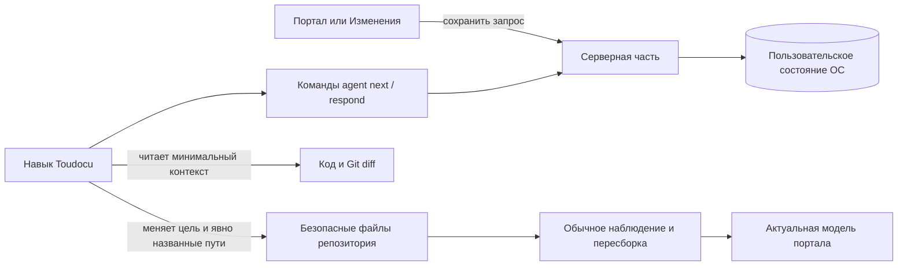

<!-- toudocu
architectureQuestion: Как сообщение из локальной документации доставляется внешнему агенту разработки без прямой интеграции с ИИ?
-->

# Доставка запроса внешнему агенту разработки

Toudocu разделяет разговор и доставку. `Discussion` содержит одну логическую
ветку, историю сообщений и `DocumentAnchor`. Каждое сохранённое сообщение
создаёт отдельную `AgentDelivery`, которую внешний агент получает через общий
локальный файл состояния. Ни HTTP-сервер, ни браузер не должны работать в момент
обработки команды.

## Компоненты и ответственность

Серверная часть владеет обсуждениями, привязками, порядком очереди, временной
блокировкой, ответами, локальным хранением и очисткой. Она не владеет разбором
Markdown, историей Git, записью исходников, языковой моделью или интеграцией с
поставщиком агента.

## Атомарная постановка в очередь

При сохранении серверная часть под одной файловой блокировкой проверяет версию
состояния и привязку, переводит сообщение человека в состояние `submitted`,
назначает монотонный `sequence` и добавляет ожидающую `AgentDelivery`.
Пока запись имеет состояние `pending`, сообщение можно изменить или удалить;
атомарное получение через `agent next` переводит её в `claimed` и делает
сообщение неизменяемым. Состояние записывается
во временный файл, синхронизируется и атомарно заменяет предыдущий файл.

Очередь относится к одному репозиторию и обрабатывается строго по порядку
поступления. `agent next` работает только со старейшей незавершённой записью.
Активная временная блокировка не позволяет второму обработчику перейти к
следующей записи; после истечения срока ту же запись можно получить повторно.
Каждая полученная запись требует `agent respond` до следующего запроса или
выхода. Успешный ответ переводит доставку в `responded`; открытая ветка сама по
себе не возвращается в очередь. Новую доставку создаёт только новое сообщение.

## Привязка цели

Привязка `document` хранит путь относительно репозитория, контрольную сумму, диапазон со
строками и столбцами в символах Unicode (нумерация с единицы), исходный текст и
до 2 КиБ контекста с каждой стороны. Перед выдачей записи сервер определяет
одно из состояний:

1. `current` — контрольная сумма совпадает, исходный диапазон действителен;
2. `moved` — единственное точное совпадение найдено рядом с прежними строками,
   во всём документе или между сохранёнными контекстами;
3. `stale` — однозначного совпадения нет;
4. `deleted` — документ или исходный фрагмент удалён.

Алгоритм не использует языковую модель и нечёткий поиск. Строки являются подсказкой, а не
доказательством актуального положения.

Привязка `file` создаётся только для обычного файла сравнения с рабочим
деревом. Она использует тот же диапазон для доступного UTF-8 текста до 2 МиБ.
Двоичный, большой или удалённый файл сохраняется как цель целиком; исчезновение
не блокирует ответ или продолжение уже созданной ветки.

## Ответ и фактическое изменение

Ответ агента дописывается в историю и идемпотентен по содержимому для `deliveryId`.
Значение `changedPaths` помогает интерфейсу открыть результат, но не доказывает
изменение. Агент может изменить `target.path` и однозначно названные в сообщении
дополнительные пути, если они входят в безопасную границу вида цели. Он не
расширяет работу на связанные документы, журнал, сгенерированные файлы или соседний
код и не запускает команды проверки. Наблюдатель и пересборка перечитывают
реальные файлы независимо от обработки запроса.

## Хранилище и восстановление

Корень состояния выбирается по правилам ОС, а ключ репозитория вычисляется из
его канонического абсолютного корня. Ветка и `HEAD` не входят в идентификатор.
Ожидающие записи и открытые обсуждения не удаляются автоматически. Пользователь
может вручную удалить любую ветку сразу; вместе с ней безвозвратно удаляются её
сообщения и незавершённые записи очереди. Отдельно от этого закрытое обсуждение
без незавершённой записи может автоматически очищаться после 30 дней без
активности во время последующих изменений локального состояния.

## Будущие расширения

Будущая интерактивная проверка добавит `ReviewGate` с решениями
`waiting|feedback|approved|cancelled`. Он будет передавать существующую
`AgentDelivery`; `Discussion`, сообщения, привязка и ответы останутся прежними.
Если ожидающий агент исчезнет, запись останется в асинхронной очереди.
Блокирующее ожидание, подтверждение и перехватчики агента в текущей версии
отсутствуют.

## Связанные документы

- [MOD-AGENT-FEEDBACK](../modules/MOD-AGENT-FEEDBACK.md)
- [FLOW-AGENT-FEEDBACK](../flows/FLOW-AGENT-FEEDBACK.md)
- [JSON обратной связи с агентом](../reference/agent-feedback-json.md)
