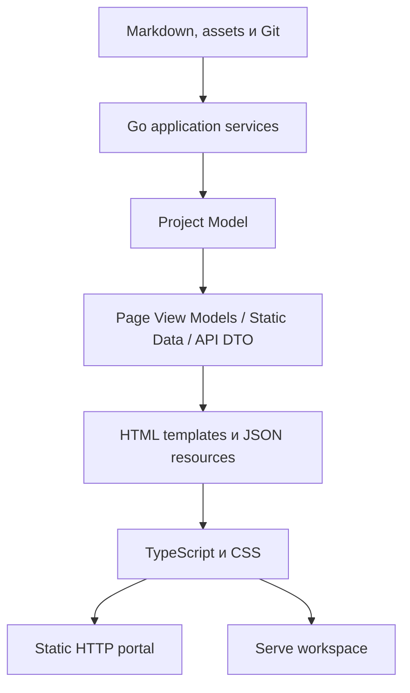

# Где проходит граница между Go-ядром и frontend runtime?

- Тип документа: Architecture
- Архитектурный вопрос: Где проходит граница между Go-ядром и frontend runtime?

Go остаётся единственным источником проектной модели и доверенной границей для
файловой системы, Git и task verification. Frontend получает только
подготовленное представление страницы, производные статические данные и явно
выданные возможности runtime.

## Поток данных

## Ответственность Go

Go читает и классифицирует документы, вычисляет связи, diagnostics, readiness и
semantic diff, нормализует пути, применяет security guards, строит page view
models, HTML, static JSON и API DTO. Bootstrap JSON сериализуется стандартным Go
serializer и содержит `schemaVersion`, runtime, относительные asset/data bases,
стабильный тип страницы и capabilities. Абсолютные filesystem paths в него не
попадают.

## Ответственность frontend

Frontend реализует представление и progressive enhancement: навигацию, поиск по
готовому индексу, preferences, tabs, dialogs, Mermaid, editor и changes UI. Общий
блокирующий `appearance.js` выполняется до первого stylesheet, проверяет
сохранённые preferences отдельно и применяет серверные defaults до первого
кадра. Он не
разбирает Markdown, не классифицирует документы, не разрешает связи, не
вычисляет readiness или diff и не принимает решений о допустимости записи.

Исходники находятся в `web/`, проверяются TypeScript strict mode и собираются
esbuild. Производные assets находятся в `internal/site/assets/generated/`,
фиксируются в репозитории и встраиваются в Go-бинарник через `go:embed`. Node.js
нужен только разработчику, изменяющему frontend; готовый бинарник и обычный
`go build ./...` от него не зависят.

## Разделение runtime

`build` создаёт multi-page read-only портал для HTTP(S) static hosting. В нём
есть основной `portal.js`, HTML content и только собственные относительные
resources. Editor client, rebuild client, server API URL и возможность записи
отсутствуют.

`serve` использует тот же renderer и `portal.js`, но Go явно добавляет
capabilities и отдельные `serve.js`, `editor.js` и `changes.js`. API остаётся
same-origin, а URL endpoint передаёт Go. Frontend не выводит режим из URL или
случайных DOM-маркеров.

Прямое открытие HTML через `file://` не является архитектурным или продуктовым
контрактом. Локальный browser runtime предоставляет существующая команда
`docu-docu serve`; новая preview-команда не нужна.

## Инварианты

- HTML обычной страницы содержит основной Markdown content до запуска JavaScript.
- `appearance.js` входит в static и serve manifest и располагается перед первым
  stylesheet на портале, в редакторе и в workspace изменений.
- Typography roles `body`, `interface`, `heading` и `mono` задаются общими CSS
  tokens; CodeMirror и diff используют `mono`, а rendered document — `body`.
- `build` не зависит от работающего Go-процесса после генерации.
- Static JSON является производным представлением одной Go project model.
- Портал работает в корне host и во вложенном URL-пути без обязательного `baseURL`.
- Asset manifest детерминирован; filenames не содержат timestamps или random data.
- Ошибка отдельного интерактивного компонента не скрывает основной content.
- Browser input остаётся недоверенным; все security decisions выполняет Go.

## Связанные документы

- [Как runtime-компоненты делят ответственность?](runtime-components.md)
- [Где проходят границы доверия?](trust-boundaries.md)
- [MOD-SITE: Статический портал](../modules/site.md)
- [UC-DOCS-01: Создать статический HTTP-портал](../use-cases/build-portal.md)
- [FLOW-DOCS-BUILD: Сборка статического HTTP-портала](../flows/FLOW-DOCS-BUILD.md)
