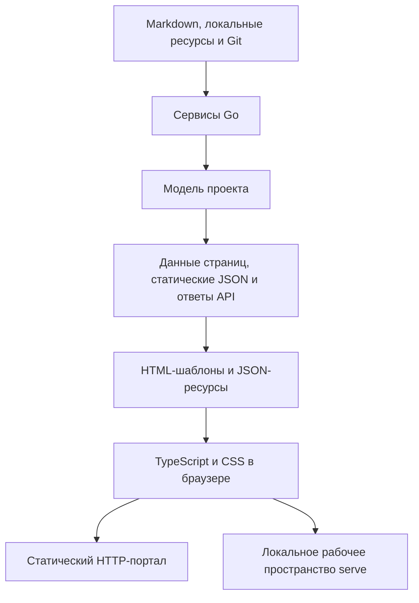

# Граница между Go и браузером

- Тип документа: Architecture
- Архитектурный вопрос: Что делает Go-часть, а что — код в браузере?

Go — единственный источник проектной модели и единственная часть, которой
разрешено принимать решения о файловой системе, Git и запуске проверок.
Браузер получает готовые данные страницы и только те возможности, которые Go
явно включил для текущего режима.

## Поток данных

## Что делает Go

Go читает и классифицирует документы, вычисляет связи и готовность задач,
сравнивает изменения, проверяет пути и допустимость записи, создаёт данные
страниц, HTML, статические JSON-файлы и ответы API.

Каждая страница получает небольшой JSON-блок запуска. В нём есть версия схемы,
режим (`static` или `serve`), тип страницы, относительные пути к ресурсам и
список разрешённых возможностей. Абсолютные пути файловой системы туда не
попадают.

## Что делает браузер

Браузер отвечает за отображение: навигацию, поиск по готовому индексу, темы,
вкладки, диалоги, Mermaid, редактор и интерфейс изменений. Он не разбирает
Markdown, не классифицирует документы, не вычисляет связи, готовность задачи
или Git diff и не решает, можно ли записать файл.

Для обсуждения браузер передаёт цель в каноническом документе, выделенный
текст или диапазон и сообщение. Go проверяет путь, извлекает исходный текст с
контекстом и определяет новое положение после изменения файла. Браузер не
создаёт запись очереди сам: он отдельно сохраняет черновик и ставит его в очередь.

Исходники TypeScript и CSS находятся в `web/`, проверяются в строгом режиме
TypeScript и собираются esbuild. Серверные оболочки находятся во встроенных
`html/template`-шаблонах `internal/site/templates/`. Оба слоя читают
одинаковые текстовые каталоги `internal/site/i18n/{en,ru}.json`; разметка в
значениях каталога запрещена. Шаблоны задают оболочки страниц и рабочих
поверхностей, а небольшие серверные компоненты Go собирает из проверенных
фрагментов с явным HTML-экранированием.

Собранные браузерные ресурсы хранятся в
`internal/site/assets/generated/` и встраиваются в бинарник. При сборке
браузерные каталоги включаются в JS-ресурсы, поэтому статическому порталу не
нужны запросы к Go или отдельный сервер локализации. Node.js нужен только при
разработке интерфейса; готовому бинарнику и обычной сборке Go он не нужен.

## Чем отличаются `build` и `serve`

`build` создаёт многостраничный портал только для чтения. После сборки ему не
нужен запущенный Go-процесс. В нём нет редактора, локального API, адреса
пересборки и возможности записать файл.

`serve` использует те же страницы, но Go явно включает дополнительные ресурсы
редактора и изменений и передаёт same-origin адреса API. Возможность
`updateCheck` разрешает браузеру обратиться только к локальному адресу проверки
версии; официальный URL релиза строит сервер. Браузер не угадывает режим по URL
или случайным HTML-атрибутам.

Прямое открытие через `file://` не поддерживается как продуктовый путь. Для
локального просмотра существует `toudocu serve`; отдельной команды `preview`
нет.

## Инварианты

- Основной текст Markdown уже находится в HTML до запуска JavaScript.
- `appearance.js` применяется до первого CSS-файла в портале, редакторе и
  изменениях, чтобы выбранная тема не мигала при загрузке.
- Общие роли шрифтов — `body`, `interface`, `heading` и `mono`; код и diff
  используют `mono`, текст документа — `body`.
- Статические JSON-файлы создаются из той же модели, что и HTML.
- Серверный HTML и браузерные состояния используют один каталог интерфейса;
  каталог содержит только текст, а структуру задают шаблоны и код
  представлений.
- Портал работает и в корне HTTP-хоста, и во вложенном URL без обязательного
  `baseURL`.
- Имена встроенных ресурсов воспроизводимы и не содержат времени или случайных
  данных.
- Ошибка отдельного интерактивного элемента не скрывает текст документа.
- Ошибка проверки версии не меняет содержимое страницы и не заставляет браузер
  обращаться к внешнему сайту.
- Любой ввод браузера считается недоверенным; решения безопасности принимает
  Go.
- Возможность `review` есть только у основного `serve`, но не у статического и
  переводного порталов.

## Связанные документы

- [Как компоненты делят ответственность?](runtime-components.md)
- [Границы доверия](trust-boundaries.md)
- [MOD-SITE: Статический портал](../modules/site.md)
- [UC-DOCS-01: Создать статический HTTP-портал](../use-cases/build-portal.md)
- [FLOW-DOCS-BUILD](../flows/FLOW-DOCS-BUILD.md)
