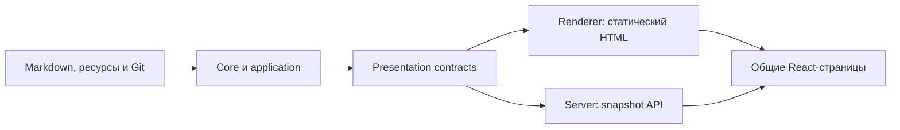

<!-- toudocu
architectureQuestion: Что делает серверный runtime, а что — код в браузере?
-->

# Граница серверного runtime и браузера

TypeScript core и application владеют документационной моделью, безопасностью,
Git, файловыми операциями и запуском процессов. Portal mapper преобразует модель
в проверяемые `PortalSnapshotV1` и `PageViewV1`. React получает только эти
проекции и доступные в текущем режиме capabilities.

## Поток данных

```mermaid
flowchart LR
    Source["Markdown, ресурсы и Git"] --> Core["Core и application"]
    Core --> View["Presentation contracts"]
    View --> Static["Renderer: статический HTML"]
    View --> Serve["Server: snapshot API"]
    Static --> React["Общие React-страницы"]
    Serve --> React
```

`build` загружает готовый renderer и browser assets, предварительно рисует все
публикуемые маршруты и заменяет выходной каталог только после успешной сборки.
Основной текст, навигация и ссылки находятся в HTML до запуска JavaScript.

`serve` раздаёт тот же снимок и единый SPA shell. React Router управляет
переходами, а watcher публикует новую revision только после успешной
перестройки. Постоянная Agent Console находится выше route outlet, поэтому её
локальное состояние и серверная сессия переживают навигацию. PTY имеет
независимый жизненный цикл и загружает xterm только при открытии терминала.

Браузер отвечает за отображение, маршрутизацию, формы и локальное состояние. Он
не разбирает Markdown, не вычисляет готовность задач, Git diff или права
доступа, не выбирает executable, argv, cwd и environment. Изменяющие запросы
повторно проверяются сервером, требуют известный action header и same-origin
контекст.

## Инварианты

- core не содержит React, HTTP и Node.js-адаптеров;
- React не реконструирует доменную семантику из UI;
- статический портал читаем без JavaScript и работает во вложенном URL;
- статический и переводной режимы не содержат editor, Discussions, Agent
  Console или PTY;
- только loopback `serve` может запускать provider process и системную оболочку;
- ошибка интерактивной функции не скрывает содержимое документа;
- завершение CLI отменяет перестройку и закрывает watcher, сервер, provider и PTY.

Решение о миграции закреплено в [ADR-012](../decisions/ADR-012.md). Границы
доверия описаны отдельно в [trust-boundaries.md](trust-boundaries.md).
