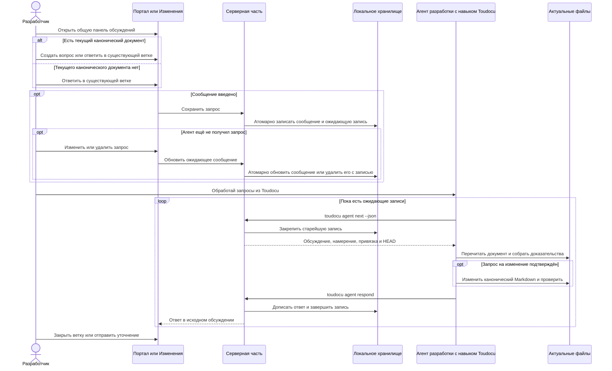

# FLOW-AGENT-FEEDBACK: Обработка локальной очереди документации

- Идентификатор: FLOW-AGENT-FEEDBACK
- Сценарий: UC-AGENT-FEEDBACK-01
- Модуль: MOD-AGENT-FEEDBACK
- Последнее обновление: 2026-08-12

## Процесс

## Важные условия

- `question` никогда не даёт разрешения изменить документацию.
- `change_request` требует проверки утверждения пользователя.
- Сообщение редактируется только пока его запись имеет состояние `pending`;
  получение через `agent next` и изменение сообщения атомарны относительно друг друга.
- После повторной попытки агент заново читает файлы: предыдущая попытка могла частично
  изменить документ.
- Ответ агента не закрывает обсуждение и не является источником фактического
  состояния документации.
- Панель показывает все ветки проекта на любой странице основного `serve`, но
  создать новую ветку можно только при наличии текущего канонического документа.
- Старая строка изменённого документа сохраняется как видимая цитата в тексте
  сообщения с обычной привязкой к документу; новый вид привязки не создаётся.

## Связанные документы

- [UC-AGENT-FEEDBACK-01](../use-cases/UC-AGENT-FEEDBACK-01.md)
- [Доставка запроса](../architecture/agent-feedback-delivery.md)
- [JSON обратной связи с агентом](../reference/agent-feedback-json.md)
