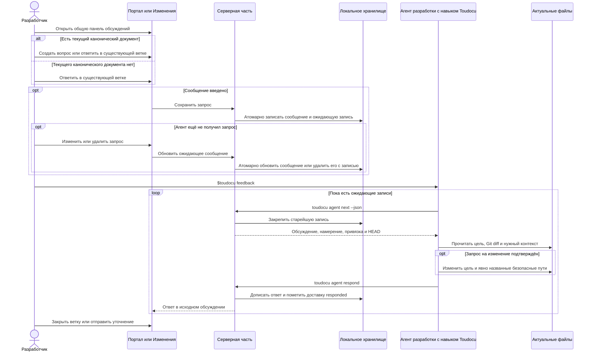

<!-- toudocu
id: FLOW-AGENT-FEEDBACK
module: MOD-AGENT-FEEDBACK
useCase: UC-AGENT-FEEDBACK-01
updated: 2026-08-14
-->

# FLOW-AGENT-FEEDBACK: Обработка локальной очереди документации

## Процесс

## Важные условия

- До чтения документации, roadmap, `UC-*`, `TASK-*`, критериев приёмки или
  статуса агент вызывает `agent next`. Только возвращённая доставка задаёт
  работу; `pending=false` завершает процесс без чтения и изменения файлов.
- `question` никогда не даёт разрешения изменить документацию.
- `change_request` требует проверки утверждения пользователя.
- Каждая полученная доставка завершается через `agent respond` до следующего
  вызова `agent next` или выхода агента.
- Открытое обсуждение не означает незавершённую доставку. После ответа новую
  работу создаёт только новое сообщение пользователя.
- Агент не запускает проверки и не меняет связанные файлы по собственной
  инициативе. Дополнительный путь должен быть однозначно назван пользователем
  и разрешён видом цели.
- Сообщение редактируется только пока его запись имеет состояние `pending`;
  получение через `agent next` и изменение сообщения атомарны относительно друг друга.
- После повторной попытки агент заново читает файлы: предыдущая попытка могла частично
  изменить документ.
- Ответ агента не закрывает обсуждение и не является источником фактического
  состояния документации.
- Панель показывает все ветки проекта на любой странице основного `serve`, но
  создать новую ветку можно только при наличии текущего канонического документа.
- Старая строка изменённого документа сохраняется как видимая цитата в тексте
  сообщения с обычной привязкой к документу; новый вид привязки не создаётся.

## Связанные документы

- [UC-AGENT-FEEDBACK-01](../use-cases/UC-AGENT-FEEDBACK-01.md)
- [Доставка запроса](../architecture/agent-feedback-delivery.md)
- [JSON обратной связи с агентом](../reference/agent-feedback-json.md)
