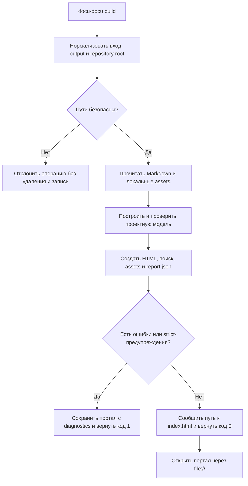

# FLOW-DOCS-BUILD: Сборка автономного портала

- Идентификатор: FLOW-DOCS-BUILD
- Сценарий: UC-DOCS-01
- Модуль: MOD-SITE
- Последнее обновление: 2026-07-28

Схема визуализирует конвейер команды `build`. Требования к результату, exit
codes и безопасной очистке определяет
[UC-DOCS-01](../use-cases/build-portal.md), а не диаграмма.

## Процесс

## Границы процесса

- Небезопасный `--output` или `--clean` блокируется до изменения файлов.
- Ошибки модели остаются доступны в сгенерированном портале и `report.json`.
- Исходный Markdown не изменяется.

## Связанные документы

- [UC-DOCS-01: Создать автономный портал](../use-cases/build-portal.md)
- [MOD-SITE: Статический портал](../modules/site.md)
- [MOD-MODEL: Проектная модель и валидация](../modules/model.md)
- [CLI-контракт](../contracts/cli.md)
