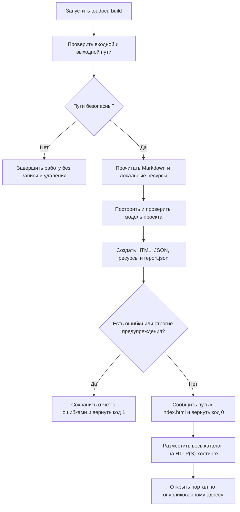

<!-- toudocu
version: 1
id: FLOW-DOCS-BUILD
module: MOD-SITE
useCase: UC-DOCS-01
updated: 2026-08-10
-->

# FLOW-DOCS-BUILD: Сборка статического HTTP-портала

Схема показывает путь от команды `build` до готового каталога, который можно
разместить на обычном HTTP-хостинге. Точные параметры и коды завершения описаны
в [UC-DOCS-01](../use-cases/build-portal.md).

## Процесс

## Что важно

- Небезопасный `--output` или `--clean` отклоняется до изменения файлов.
- Ошибки модели остаются видны в портале и `report.json`.
- Исходные документы не изменяются.
- После публикации сервер Toudocu не нужен: браузер загружает только файлы из
  собранного каталога.

## Связанные документы

- [UC-DOCS-01: Создать статический HTTP-портал](../use-cases/build-portal.md)
- [MOD-SITE: Статический портал](../modules/site.md)
- [MOD-MODEL: Проектная модель и проверка](../modules/model.md)
- [CLI-контракт](../contracts/cli.md)
