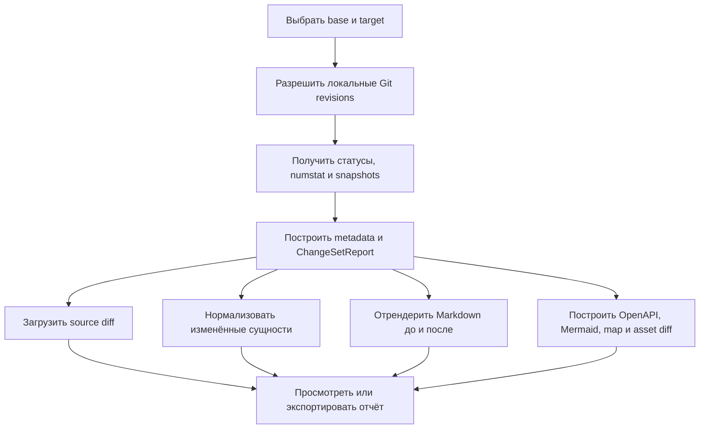

# FLOW-DOCS-CHANGES: Построение и просмотр изменений документации

- Идентификатор: FLOW-DOCS-CHANGES
- Сценарий: UC-DOCS-05
- Модуль: MOD-CHANGES
- Последнее обновление: 2026-07-31

Процесс показывает путь от явно выбранного Git-диапазона к ленивым
представлениям одного детерминированного change set.

## Процесс

## Связанные документы

- [UC-DOCS-05: Просматривать изменения документации](../use-cases/UC-DOCS-05.md)
- [MOD-CHANGES: Изменения документации](../modules/MOD-CHANGES.md)
- [Как Git-состояния становятся change set?](../architecture/documentation-changes.md)
