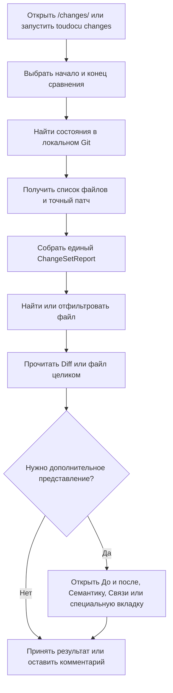

<!-- toudocu
id: FLOW-DOCS-CHANGES
module: MOD-CHANGES
useCase: UC-DOCS-05
updated: 2026-08-10
-->

# FLOW-DOCS-CHANGES: Просмотр изменений

Схема показывает, как выбранный диапазон Git превращается в список файлов и
понятные представления каждого изменения.

## Процесс

Точный патч Git остаётся доступным, даже если Markdown, OpenAPI, Mermaid или
другой дополнительный анализ завершился ошибкой. Ни один шаг не меняет Git.

## Связанные документы

- [UC-DOCS-05: Просматривать изменения документации](../use-cases/UC-DOCS-05.md)
- [MOD-CHANGES: Изменения документации](../modules/MOD-CHANGES.md)
- [Как состояния Git становятся отчётом?](../architecture/documentation-changes.md)
