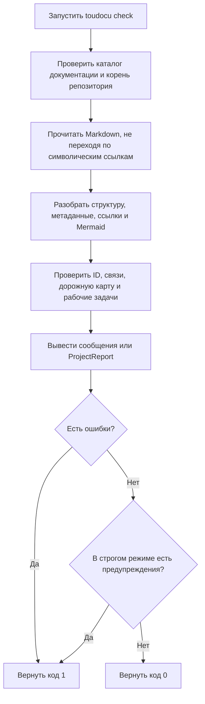

# FLOW-DOCS-CHECK: Проверка документационного контракта

- Идентификатор: FLOW-DOCS-CHECK
- Сценарий: UC-DOCS-02
- Модуль: MOD-MODEL
- Последнее обновление: 2026-08-10

Команда `check` только читает документацию и сообщает о найденных проблемах.
Полный набор правил описан в
[UC-DOCS-02](../use-cases/check-documentation.md).

## Процесс

## Что важно

- Команда не собирает портал и не меняет документы.
- Команды из разделов «Проверка» рабочих задач не запускаются.
- Без `--strict` предупреждения попадают в отчёт, но не меняют успешный код
  завершения.

## Связанные документы

- [UC-DOCS-02: Проверить документацию](../use-cases/check-documentation.md)
- [MOD-MODEL: Проектная модель и проверка](../modules/model.md)
- [MOD-CLI: CLI и процессы задач](../modules/cli.md)
- [Правила проверки](../guides/testing.md)
