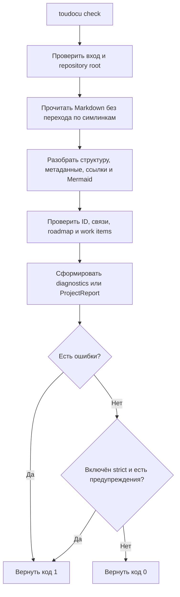

# FLOW-DOCS-CHECK: Проверка документационного контракта

- Идентификатор: FLOW-DOCS-CHECK
- Сценарий: UC-DOCS-02
- Модуль: MOD-MODEL
- Последнее обновление: 2026-07-28

Схема показывает read-only проверку документации. Полный набор правил и
условия успешного завершения определяет
[UC-DOCS-02](../use-cases/check-documentation.md).

## Процесс

## Границы процесса

- Команда не создаёт сайт и не изменяет исходные документы.
- Команды из разделов `Проверка` рабочих задач не выполняются.
- В обычном режиме предупреждения входят в отчёт, но не меняют успешный exit
  code.

## Связанные документы

- [UC-DOCS-02: Проверить документацию](../use-cases/check-documentation.md)
- [MOD-MODEL: Проектная модель и валидация](../modules/model.md)
- [MOD-CLI: CLI и workflow задач](../modules/cli.md)
- [Правила проверки](../guides/testing.md)
