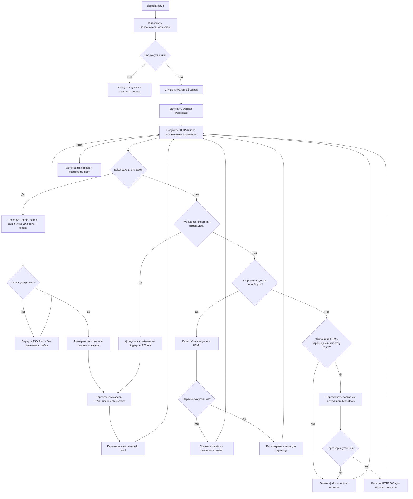

# FLOW-DOCS-SERVE: Локальный просмотр портала

- Идентификатор: FLOW-DOCS-SERVE
- Сценарий: UC-DOCS-03
- Модуль: MOD-SITE
- Последнее обновление: 2026-07-31

Схема визуализирует жизненный цикл команды `serve`. Сетевые ограничения,
ошибочные сценарии и постусловия определяет
[UC-DOCS-03](../use-cases/serve-portal.md).

## Процесс

## Границы процесса

- Обычные маршруты раздают output; editor API ограничен workspace-файлами внутри
  docs root и не предоставляет доступ к остальному репозиторию.
- По умолчанию используется loopback; доступ через `0.0.0.0` включается явно.
- Ручная пересборка обновляет модель и HTML, но не закрывает listener и не
  меняет его адрес.
- Editor, CodeMirror, API, polling и ручная пересборка существуют только в
  `serve`; статический портал через `file://` не содержит их markup или assets.
- Ошибка пересборки не останавливает уже запущенный сервер.

## Связанные документы

- [UC-DOCS-03: Просматривать документацию на локальном сервере](../use-cases/serve-portal.md)
- [FLOW-DOCS-BUILD: Сборка автономного портала](FLOW-DOCS-BUILD.md)
- [MOD-SITE: Статический портал](../modules/site.md)
- [CLI-контракт](../contracts/cli.md)
- [HTTP-контракт editor API](../contracts/editor-http.md)
