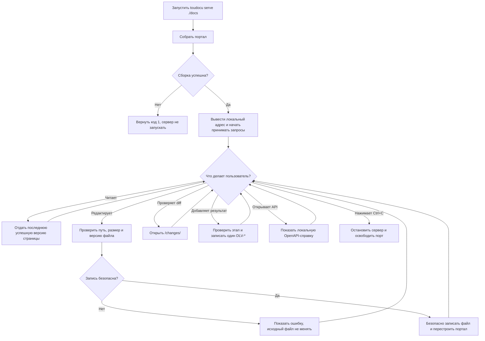

# FLOW-DOCS-SERVE: Локальная работа с порталом

- Идентификатор: FLOW-DOCS-SERVE
- Сценарий: UC-DOCS-03
- Модуль: MOD-SITE
- Последнее обновление: 2026-08-10

Схема показывает основной жизненный цикл `serve`. Подробные ошибки и
дополнительные пути описаны в
[UC-DOCS-03](../use-cases/serve-portal.md).

## Процесс

## Что происходит вне явных действий

- Изменение файла внешним редактором запускает повторную сборку после того, как
  содержимое перестало меняться. При ошибке сервер сохраняет последнюю рабочую
  версию портала.
- Основные HTML-страницы могут переходить друг в друга без полной перезагрузки.
  Редактор, изменения, API, переводы и внешние ссылки всегда открываются обычным
  переходом браузера.
- Поиск загружается при первом обращении к нему, Mermaid — когда диаграмма
  приближается к видимой области страницы.
- Настроенные переводы пересобираются отдельно и доступны только для чтения.
- Проверка новой версии выполняется один раз за процесс, только для основного
  портала и только если не указан `--no-update-check`. Её ошибка не мешает
  локальной работе.

## Границы процесса

- По умолчанию сервер доступен только на `127.0.0.1`. Режим `0.0.0.0` нужно
  включить явно; встроенных TLS и авторизации нет.
- Редактор видит только разрешённые файлы внутри каталога документации.
- Статический `build` не содержит редактор, локальный API, изменения, опрос
  файлов и ручную пересборку.
- Страница API использует встроенные ресурсы и позволяет выполнять только
  `GET` и `HEAD`.
- Ошибка повторной сборки не останавливает уже запущенный сервер.

## Связанные документы

- [UC-DOCS-03: Просматривать документацию на локальном сервере](../use-cases/serve-portal.md)
- [FLOW-DOCS-BUILD: Сборка статического HTTP-портала](FLOW-DOCS-BUILD.md)
- [MOD-SITE: Статический портал](../modules/site.md)
- [CLI-контракт](../contracts/cli.md)
- [HTTP-контракт редактора](../contracts/editor-http.md)
