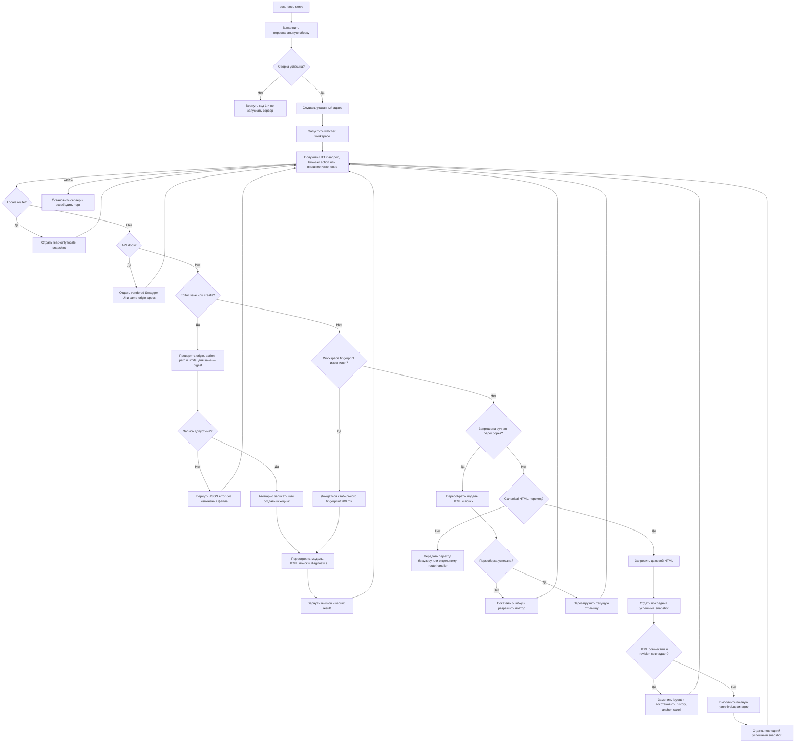

# FLOW-DOCS-SERVE: Локальный просмотр портала

- Идентификатор: FLOW-DOCS-SERVE
- Сценарий: UC-DOCS-03
- Модуль: MOD-SITE
- Последнее обновление: 2026-08-05

Схема визуализирует жизненный цикл команды `serve`. Сетевые ограничения,
ошибочные сценарии и постусловия определяет
[UC-DOCS-03](../use-cases/serve-portal.md).

## Процесс

## Границы процесса

- Обычные маршруты раздают output; editor API ограничен workspace-файлами внутри
  docs root и не предоставляет доступ к остальному репозиторию.
- По умолчанию используется loopback; доступ через `0.0.0.0` включается явно.
- Ручная пересборка обновляет модель, HTML и поиск, но не закрывает listener и не
  меняет его адрес.
- HTTP navigation никогда не запускает rebuild. При configured translations
  watcher пересобирает только изменившийся root; locale mount остаётся read-only
  и не получает editor, changes или canonical API.
- Мягкая навигация работает только между canonical HTML-страницами текущей
  revision. Editor, changes, API, locale и external routes, а также любой сбой
  проверки используют обычную полную загрузку.
- Search index загружается при первом обращении к поиску, Mermaid — при
  приближении диаграммы к viewport; загруженные runtime сохраняются между
  мягкими переходами.
- Editor, CodeMirror, API, polling и ручная пересборка существуют только в
  `serve`; статический портал через `file://` не содержит их markup или assets.
- API docs существует только в canonical `serve`, не загружает CDN и разрешает
  Try it out только для `GET`/`HEAD`; static и locale portals его не содержат.
- Ошибка пересборки не останавливает уже запущенный сервер.

## Связанные документы

- [UC-DOCS-03: Просматривать документацию на локальном сервере](../use-cases/serve-portal.md)
- [FLOW-DOCS-BUILD: Сборка автономного портала](FLOW-DOCS-BUILD.md)
- [MOD-SITE: Статический портал](../modules/site.md)
- [CLI-контракт](../contracts/cli.md)
- [HTTP-контракт editor API](../contracts/editor-http.md)
