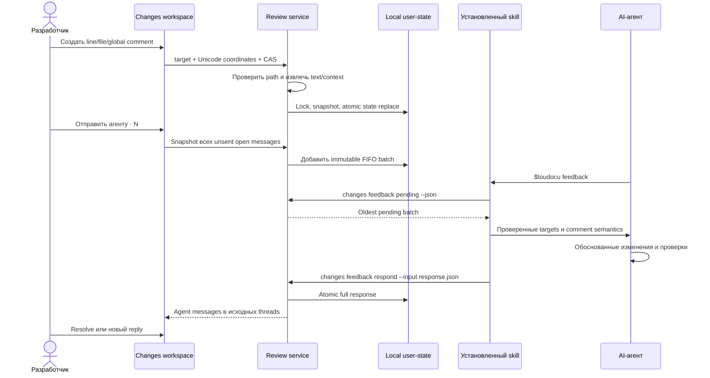

# FLOW-REVIEW-FEEDBACK: Передача локального feedback агенту

- Идентификатор: FLOW-REVIEW-FEEDBACK
- Сценарий: UC-REVIEW-01
- Модуль: MOD-REVIEW
- Последнее обновление: 2026-08-09

## Процесс

## Границы процесса

- Browser не является источником selected text, context или digest.
- `pending` повторяет oldest batch до полного успешного `respond`.
- Response с missing, duplicate или invalid item не меняет state.
- `fixed` остаётся outcome сообщения и не закрывает discussion.
- Ни UI, ни CLI не запускают агента и не изменяют Git.

## Связанные документы

- [UC-REVIEW-01](../use-cases/UC-REVIEW-01.md)
- [MOD-REVIEW](../modules/MOD-REVIEW.md)
- [Перенос anchors](../architecture/review-anchoring.md)
- [CLI-контракт](../contracts/cli.md)
