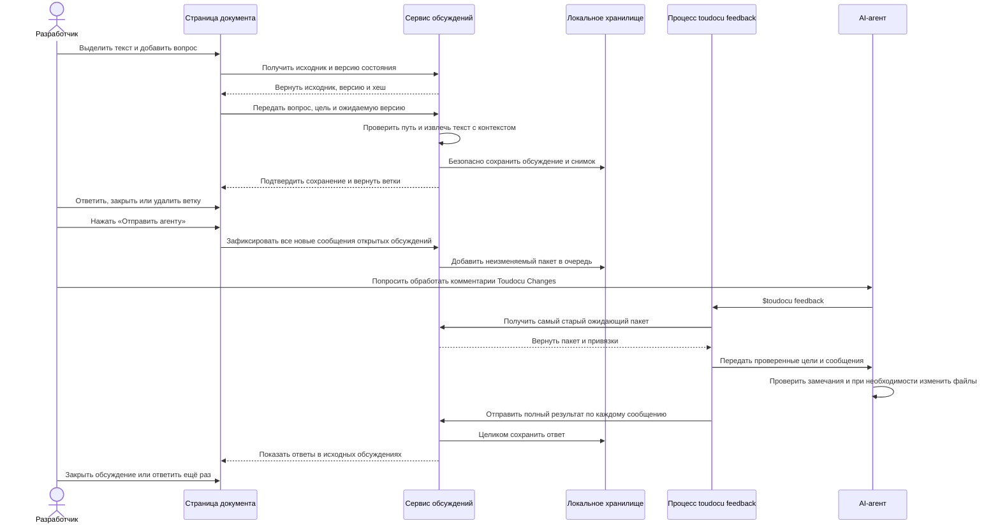

# FLOW-REVIEW-FEEDBACK: Передача комментариев агенту

- Идентификатор: FLOW-REVIEW-FEEDBACK
- Сценарий: UC-REVIEW-01
- Модуль: MOD-REVIEW
- Последнее обновление: 2026-08-11

## Процесс

## Что важно

- Для точной привязки браузер передаёт координаты, а сервер сам извлекает
  выделенный текст и контекст. Если отрисованный фрагмент нельзя однозначно
  найти в Markdown, вопрос привязывается ко всему файлу и содержит сам фрагмент.
- Повторный запрос ожидающих комментариев возвращает самый старый пакет, пока
  он не принят целиком.
- Ответ с пропущенным, повторяющимся или неверным элементом не меняет ни одного
  обсуждения.
- Результат «Исправлено» не закрывает обсуждение автоматически.
- Удаление ветки отменяет затронутый ожидающий пакет, не переписывая его.
- Ни интерфейс, ни CLI не запускают агента и не меняют Git.

## Связанные документы

- [UC-REVIEW-01](../use-cases/UC-REVIEW-01.md)
- [MOD-REVIEW](../modules/MOD-REVIEW.md)
- [Привязка комментариев](../architecture/review-anchoring.md)
- [CLI-контракт](../contracts/cli.md)
