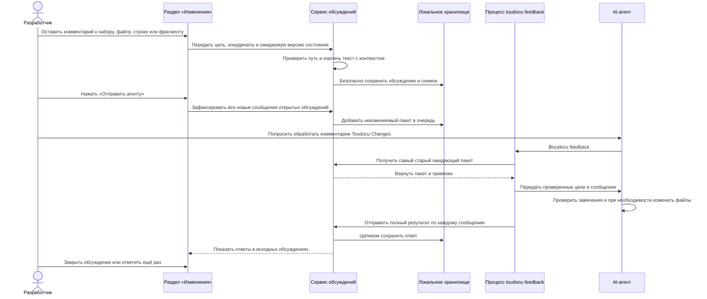

# FLOW-REVIEW-FEEDBACK: Передача комментариев агенту

- Идентификатор: FLOW-REVIEW-FEEDBACK
- Сценарий: UC-REVIEW-01
- Модуль: MOD-REVIEW
- Последнее обновление: 2026-08-10

## Процесс

## Что важно

- Браузер не задаёт выделенный текст, контекст и хеш: сервер извлекает их сам.
- Повторный запрос ожидающих комментариев возвращает самый старый пакет, пока
  он не принят целиком.
- Ответ с пропущенным, повторяющимся или неверным элементом не меняет ни одного
  обсуждения.
- Результат «Исправлено» не закрывает обсуждение автоматически.
- Ни интерфейс, ни CLI не запускают агента и не меняют Git.

## Связанные документы

- [UC-REVIEW-01](../use-cases/UC-REVIEW-01.md)
- [MOD-REVIEW](../modules/MOD-REVIEW.md)
- [Привязка комментариев](../architecture/review-anchoring.md)
- [CLI-контракт](../contracts/cli.md)
