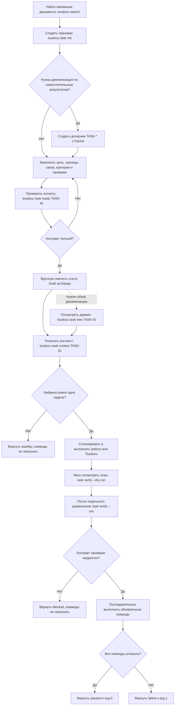

<!-- toudocu
version: 1
id: FLOW-TASK-WORKFLOW
module: MOD-CLI
useCase: UC-TASK-01, UC-TASK-02, UC-TASK-03
updated: 2026-08-21
-->

# FLOW-TASK-WORKFLOW: Работа с проверяемой задачей

Схема связывает подготовку задачи, безопасное получение контекста и отдельный,
явно разрешённый запуск команд проверки.

## Процесс

## Что важно

- `task context`, `task ready` и `task verify --dry-run` не выполняют системные
  команды и не меняют Markdown.
- `task verify --run` запускается только после явного разрешения и только для
  доверенных команд, записанных в выбранной задаче; команды детей не запускаются.
- Ошибка одной команды не скрывает результаты остальных; превышение времени
  останавливает всё дерево процессов этой команды.
- Смысл запроса, уместность связей и выполнение критериев оценивает агент или
  разработчик, а не Toudocu.

## Связанные документы

- [UC-TASK-01: Получить контекст рабочей задачи](../use-cases/task-workflow.md)
- [UC-TASK-02: Выполнить проверки рабочей задачи](../use-cases/task-verify.md)
- [UC-TASK-03: Подготовить новую рабочую задачу](../use-cases/UC-TASK-03.md)
- [MOD-CLI: CLI и процессы задач](../modules/cli.md)
- [Руководство по рабочим задачам](../guides/work-items.md)
- [CLI-контракт](../contracts/cli.md)
