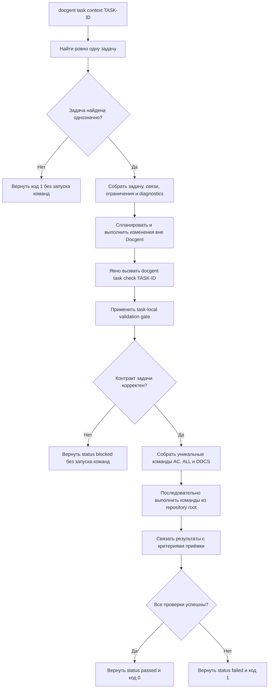

# FLOW-TASK-WORKFLOW: Работа с проверяемой задачей

- Идентификатор: FLOW-TASK-WORKFLOW
- Сценарий: UC-TASK-01, UC-TASK-02
- Модуль: MOD-CLI
- Последнее обновление: 2026-07-28

Схема связывает read-only получение контекста и явный запуск проверок. Контракт
этих операций определяют [UC-TASK-01](../use-cases/task-workflow.md) и
[UC-TASK-02](../use-cases/task-check.md).

## Процесс

## Границы процесса

- `task context` никогда не выполняет системные команды.
- `task check` запускает только явно объявленные доверенные команды после
  локального validation gate.
- Ошибка одной команды не останавливает остальные; timeout завершает дерево
  процессов.

## Связанные документы

- [UC-TASK-01: Получить контекст рабочей задачи](../use-cases/task-workflow.md)
- [UC-TASK-02: Выполнить проверки рабочей задачи](../use-cases/task-check.md)
- [MOD-CLI: CLI и workflow задач](../modules/cli.md)
- [Руководство по рабочим задачам](../guides/work-items.md)
- [CLI-контракт](../contracts/cli.md)
