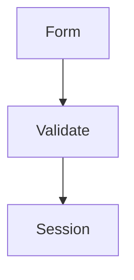

# Процессы и пользовательские сценарии

«Пользовательские сценарии» являются самостоятельным верхнеуровневым разделом
и каноническим домом `UC-*`. Раздел «Процессы» показывает сводное поведение
проекта. Его общий каталог объединяет две связанные, но не взаимозаменяемые
сущности:

| Сущность | Отвечает на вопрос | Источник | Каноническая страница |
|---|---|---|---|
| `UC-*` | Что получает актор и каковы требования? | `use-cases/*.md` | `/use-cases/UC-*.html` |
| `FLOW-*` | Как визуально устроен переиспользуемый процесс? | `flows/*.md` | `/flows/FLOW-*.html` |

`/processes/index.html` является полной сводной точкой входа. На странице можно
искать по ID и названию, фильтровать записи по типу, модулю и связанному use
case. В основном дереве навигации `UC-*` перечисляются только под
«Пользовательскими сценариями». Внутри «Процессов» находятся «Все процессы»,
«Визуальные процессы» и документы `FLOW-*`. Каталоги
`/use-cases/index.html` и `/flows/index.html` сохраняют типизированные
представления той же модели.

## Пользовательский сценарий

Документ use case задаёт требования, актора, предусловия, основной и
альтернативные сценарии, критерии приёмки, начальный и конечные экраны:

```md
# UC-AUTH-01: Вход пользователя

- Идентификатор: UC-AUTH-01
- Модуль: MOD-AUTH
- Начальный экран: SC-AUTH-LOGIN
- Конечные экраны: SC-ACCOUNT-DASHBOARD
- Статус: Реализован
```

Каноническая HTML-страница `UC-*` является рабочим пространством сценария и
имеет четыре вкладки:

1. «Описание» — исходный Markdown, требования и критерии.
2. «Карта» — только достижимые экраны и переходы выбранного `UC-*`.
3. «Проиграть» — пошаговый viewer с действиями, ошибками, back и reset.
4. «Связи» — модуль, `FLOW-*`, экраны, задачи, расположение в коде,
   связанные контракты и строки traceability.

Состояние вкладки хранится в hash URL: `#overview`, `#map`, `#play` или
`#links`. Поэтому ссылку на нужное представление можно передать другому
участнику без создания отдельной страницы. Вкладки работают с клавиатуры.

## Визуальный процесс

`FLOW-*` — самостоятельный именованный документ с Mermaid-диаграммой. Он
подходит для процесса, который используется несколькими сценариями, описывает
межсистемное взаимодействие или должен читаться вне конкретного UI:

````md
# FLOW-AUTH-LOGIN: Проверка входа

- Идентификатор: FLOW-AUTH-LOGIN
- Модуль: MOD-AUTH
- Сценарий: UC-AUTH-01, UC-AUTH-02


````

Поле `Сценарий` поддерживает несколько `UC-*`. Docgent строит обе стороны
связи: процесс показывает связанные сценарии, а каждый use case — связанные
процессы. Mermaid остаётся представлением; требования и критерии не извлекаются
из текста диаграммы.

## Раздел «Экраны»

«Экраны» отвечает за структуру интерфейса, а не за полный перечень процессов.
В нём находятся:

- общая Screen Map и её режимы;
- каталог `SC-*`;
- страницы экранов, состояний и переходов `TR-*`;
- входящие и исходящие связи, previews и hotspots.

Карта и проигрывание конкретного сценария отображаются внутри страницы
`UC-*`, потому что относятся к процессу. Общая карта остаётся в «Экранах»,
поскольку показывает всю топологию интерфейса независимо от одного сценария.

## Стабильные URL и JSON

Имена исходных Markdown-файлов не формируют публичный URL. При наличии
безопасного стабильного ID Docgent создаёт:

```text
/processes/index.html
/use-cases/UC-AUTH-01.html
/flows/FLOW-AUTH-LOGIN.html
/screens/SC-AUTH-LOGIN.html
```

Дублирующая страница `/flows/UC-AUTH-01.html` не создаётся. В schema v1
`knowledge.flows[]` содержит `useCaseIds`, а `knowledge.useCases[]` —
`flowIds`. Экранные ветки по-прежнему находятся в top-level
`playableFlows[]`.

## Отказоустойчивость

Ошибка экранного графа не блокирует исходный use case или каталог процессов.
Вместо карты или проигрывания отображается diagnostic. Ошибка отдельной
Mermaid-диаграммы показывает исходный код, не нарушая остальные страницы.
Весь интерфейс остаётся read-only и работает через `file://`.
