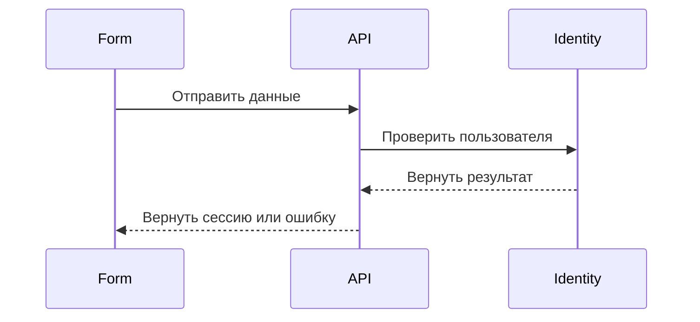

# Пользовательские сценарии и процессы

`UC-*` и `FLOW-*` связаны, но отвечают на разные вопросы.

| Документ | Главный вопрос | Исходники | Страница портала |
|---|---|---|---|
| `UC-*` | Что получает пользователь и при каких условиях? | `use-cases/*.md` | `/use-cases/UC-*.html` |
| `FLOW-*` | Как проходит значимое взаимодействие или ветвление? | `flows/*.md` | `/flows/FLOW-*.html` |

Каталог сценариев находится по `/use-cases/index.html`, каталог процессов — по
`/processes/index.html`. Отдельного `/flows/index.html` нет.

## Пользовательский сценарий `UC-*`

Сценарий называет актора, предусловия, основной путь, понятные ошибки,
результат и, для интерфейса, начальный и конечные экраны:

```md
# UC-AUTH-01: Войти в систему

- Идентификатор: UC-AUTH-01
- Модуль: MOD-AUTH
- Начальный экран: SC-AUTH-LOGIN
- Конечные экраны: SC-ACCOUNT-DASHBOARD
- Статус: Реализован
```

Пишите путь от первого действия человека до наблюдаемого результата. Не
подменяйте его перечнем внутренних функций, HTTP-обработчиков или абстрактных
слов вроде «обработать сущность».

Страница `UC-*` в портале содержит четыре вкладки:

1. «Описание» — исходный Markdown и требования.
2. «Карта» — экраны и переходы только этого сценария.
3. «Проиграть» — пошаговый выбор действий с возвратом и началом заново.
4. «Связи» — модуль, процессы, экраны, задачи, контракты и расположение в коде.

Выбранная вкладка хранится в URL: `#overview`, `#map`, `#play` или `#links`.
Такую ссылку можно передать другому участнику. Вкладки доступны с клавиатуры.

## Процесс `FLOW-*`

`FLOW-*` — самостоятельный документ с Mermaid-диаграммой одного значимого
взаимодействия: последовательности между компонентами, ветвления или обработки
ошибки. Не создавайте процесс для каждого простого запроса — такие детали
остаются в API-контракте.

````md
# FLOW-AUTH-LOGIN: Проверка входа

- Идентификатор: FLOW-AUTH-LOGIN
- Модуль: MOD-AUTH
- Сценарий: UC-AUTH-01, UC-AUTH-02


````

Один процесс может ссылаться на несколько `UC-*`; обратные связи Toudocu
строит сам. Mermaid здесь только объясняет процесс. Требования и критерии из
текста диаграммы не извлекаются.

Архитектура отвечает за компоненты и границы системы, а `FLOW-*` — за конкретную
последовательность взаимодействия. Не дублируйте одно и то же в обоих местах.

## Экраны

Раздел «Экраны» содержит общую карту, документы `SC-*`, состояния, переходы
`TR-*`, превью и кликабельные зоны. Карта одного сценария и его пошаговое
прохождение находятся на странице `UC-*`; общая карта показывает весь
интерфейс независимо от сценария.

## Стабильные адреса и JSON

Публичный адрес строится из безопасного стабильного ID, а не из произвольного
имени Markdown-файла:

```text
/processes/index.html
/use-cases/index.html
/use-cases/UC-AUTH-01.html
/flows/FLOW-AUTH-LOGIN.html
/screens/SC-AUTH-LOGIN.html
```

Дублирующая страница `/flows/UC-AUTH-01.html` не создаётся. В JSON версии 1
`knowledge.flows[]` содержит `useCaseIds`, а `knowledge.useCases[]` —
`flowIds`. Пошаговые экранные сценарии остаются в `playableFlows[]`.

Если граф экранов повреждён, исходный текст сценария и каталог процессов всё
равно доступны. Вместо карты показывается понятное сообщение. Ошибка одной
Mermaid-диаграммы показывает её исходник и не ломает остальные страницы.
