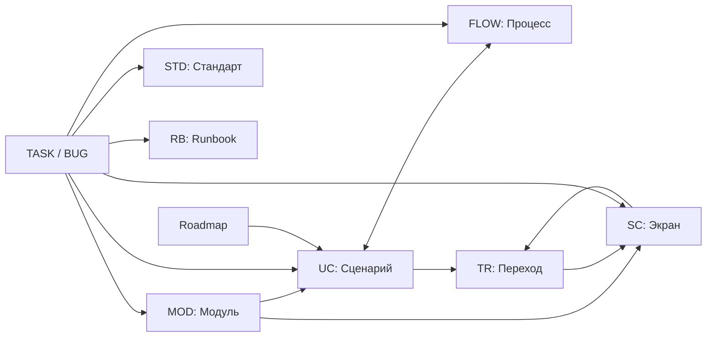

# Модель документов и связей

Справочник описывает машиночитаемые обещания Markdown-документов: как путь
определяет вид документа, какие идентификаторы и связи распознаёт Docu-docu и
что именно проверяет CLI. Он помогает автору заранее понять структурный
контракт, но не заменяет смысловую проверку содержания.

Если документу не нужны стабильный ID, проверяемая связь или специальное
представление, используйте обычный Markdown. Само расположение файла не делает
документ полезным, а успешный `check` не подтверждает достоверность текста.

## Граница проверки

Docu-docu проверяет только явно заявленные обещания:

| Сигнал | Обещание | Проверка |
|---|---|---|
| Обычный Markdown | Безопасный читаемый документ | Markdown, локальные ссылки и базовые редакционные предупреждения |
| Зарезервированный путь | Специальный вид документа | Контракт соответствующего вида |
| Стабильный ID | Устойчивая идентичность сущности | Формат, уникальность и допустимое расположение |
| Поле с ID или локальная ссылка | Явная связь | Существование и допустимый тип цели |
| Чекбокс в `roadmap.md` | Элемент глобального охвата | Поддерживаемый ID и вычисление состояния для `UC-*` |
| `task ready` | Полный task contract | Обязательные поля, разделы, связи и проверки |
| `task verify --run` | Разрешение выполнить команды | Task-local validation до запуска |

Ошибки защищают безопасность путей, идентичность, целостность связей и
исполняемые контракты. Предупреждения сообщают о редакционной полноте,
неизвестном статусе или устаревании. Не добавляйте вымышленные сведения ради
устранения warning.

## Как определяется вид документа

| Путь | Вид и специальное поведение |
|---|---|
| `index.md` | Главная страница проекта; ожидается в каждом documentation root |
| `status.md` | Текущий снимок состояния; task-чек-листы запрещены |
| `roadmap.md` | Глобальный охват и агрегированный прогресс |
| `risks.md` | Реестр секций `RISK-*` и прогресса мер снижения |
| `ideas.md` | Свободные идеи без обязательного metadata-контракта |
| `notes.md` | Свободные заметки без обязательного metadata-контракта |
| `modules/*.md` | Модуль `MOD-*` с границей и правилами |
| `use-cases/*.md` | Пользовательский сценарий `UC-*` |
| `flows/*.md` | Визуальный процесс `FLOW-*` с Mermaid |
| `screens/SC-*.md` | Экран `SC-*`, состояния и переходы `TR-*` |
| `screens/index.md` | Входная страница раздела экранов без `SC-*`-сущности |
| `screens/hotspots.json` | Интерактивные области существующих `SC-*` и `TR-*` |
| `decisions/*.md` | Архитектурное решение `ADR-*` |
| `quality/STD-*.md` | Обязательный стандарт `STD-*` |
| `quality/index.md` | Входная страница раздела стандартов |
| `runbooks/RB-*.md` | Эксплуатационная процедура `RB-*` |
| `runbooks/index.md` | Входная страница раздела runbooks |
| `work/TASK-*.md`, `work/BUG-*.md`, `work/archive/YYYY/*.md` | Активный или архивный рабочий элемент с единым task contract |
| `architecture/overview.md` | Обязательная граница системы и карта архитектурных вопросов |
| Другой `architecture/**/*.md` | Ответ на один архитектурный вопрос |
| `contracts/**/*.openapi.{yaml,yml,json}` | OpenAPI 3.0/3.1 source с отдельной структурной проверкой |
| Другой Markdown-файл в `contracts/`, `guides/`, `reference/` | Контракт, руководство или справочник без обязательного entity ID |
| Корневой `CHANGELOG.md` репозитория | Единственный специальный журнал релизных изменений, если существует |
| Любой другой путь | Обычный Markdown без встроенного typed-контракта |

Неизвестный верхнеуровневый раздел с Markdown объявляется собственным
`index.md`: `Тип: Custom`, владелец, описание и полезный H1. Это добавляет
навигационный раздел, но не новую встроенную семантику.

Подробные смысловые границы видов приведены в [справочнике видов
документов](document-types.md).

## Идентичность

Стабильные ID не зависят от заголовка или имени файла. Переименование не должно
менять ID; при реальном изменении идентичности все ссылки обновляются вместе.

| Сущность | Формат ID | Область уникальности |
|---|---|---|
| Модуль | `MOD-*` | Весь documentation root |
| Бизнес-правило модуля | `BR-*` | Весь documentation root |
| Use case | `UC-*` | Весь documentation root |
| Процесс | `FLOW-*` | Весь documentation root |
| Экран | `SC-<AREA>-<NAME>` | Весь documentation root |
| Переход | `TR-<AREA>-<NUMBER>` | Весь documentation root |
| Решение | `ADR-*` | Весь documentation root |
| Стандарт | `STD-*` | Весь documentation root |
| Runbook | `RB-*` | Весь documentation root |
| Задача | `TASK-<AREA>-<NUMBER>` | Активные и архивные `work/**` вместе |
| Дефект | `BUG-<AREA>-<NUMBER>` | Активные и архивные `work/**` вместе |
| Критерий приёмки | `AC-*` | Один work item |

Одинаковый стабильный ID нельзя объявить дважды. Относительные Markdown-ссылки
должны разрешаться внутри repository root; ссылка является самостоятельной
явной связью даже тогда, когда она не участвует в typed-модели.

## Карта основных связей

Диаграмма помогает быстро увидеть основные направления навигации по модели.
Она не задаёт обязательность, кратность или исключения: нормативные правила
остаются в следующей матрице и подробных разделах справочника. Граница системы,
внутри которой строится модель, описана в [обзоре
архитектуры](../architecture/overview.md).



## Матрица typed-связей

В колонке «Обратная сторона» указано, создаёт ли Docu-docu обратную связь в
модели и портале. Сгенерированная обратная сторона не требует второго поля в
Markdown.

| Источник | Объявление | Цель | Кратность и обязательность | Обратная сторона |
|---|---|---|---|---|
| `UC-*` | `Модуль` / `Module` | `MOD-*` | Ровно одна | Модуль показывает связанные use cases |
| `UC-*` | `Начальный экран` / `Start screen` | `SC-*` | Необязательно, не более одного | Экран участвует в модели сценария |
| `UC-*` | `Конечные экраны` / `Terminal screens` | `SC-*` | Необязательный список | Экраны участвуют в модели сценария |
| `UC-*` | `Экраны` / `Screens` | `SC-*` | Необязательный список | Экраны входят в выбранный сценарий |
| `FLOW-*` | `Сценарий` / `Scenario` | `UC-*` | Один или несколько для продуктового flow | Каждый use case получает связанный flow |
| `FLOW-*` | Markdown-ссылка для архитектурного flow | Документ архитектуры | Требуется, если `Scenario` отсутствует | Обычный backlink |
| `FLOW-*` | `Модуль` / `Module` | `MOD-*` | Необязательно | Атрибут и фильтр flow; обратная коллекция не создаётся |
| `SC-*` | `Модуль` / `Module` | `MOD-*` | Ровно одна | Экран доступен модулю и use-case представлениям |
| `SC-*` | `Родительский экран` / `Parent screen` | `SC-*` | Необязательно, не более одного | Производная дочерняя связь |
| Строка `TR-*` | `Use case` | `UC-*` | Ровно один | Переход входит в экранный граф use case |
| Строка `TR-*` | `Result` | `SC-*` | Ровно один | Целевой экран получает входящий переход |
| Обычный `TASK-*` | `Модуль` / `Module` | `MOD-*` | Обязателен для non-Draft | Связанный task context |
| `BUG-*` | `Модуль` / `Module` | `MOD-*` | Обязателен во всех статусах | Связанный task context |
| Обычный `TASK-*` | `Сценарий` / `Use case` | `UC-*` | Обязателен для non-Draft Feature; для других типов допускается обоснованное отсутствие | Связанный task context |
| `BUG-*` | `Сценарий` / `Use case` | `UC-*` | Обязателен либо явно `Не применяется` с описанной связью с поведением | Связанный task context |
| Work item | `Процесс` / `Flow` | `FLOW-*` | Необязательно, не более одного | Flow включается в task context |
| Work item | `Экраны` / `Screens` | `SC-*` | Необязательный список | Экраны включаются в task context |
| Work item | `Переходы` / `Transitions` | `TR-*` | Необязательный список | Переходы включаются в task context и traceability |
| Work item | `Стандарты` / `Standards` | `STD-*` | Необязательный список | Документы становятся required reads |
| Work item | `Затронутые runbooks` / `Affected runbooks` | `RB-*` | Необязательный список | Документы становятся required reads |
| Work item | `Зависит от` / `Depends on` | `TASK-*` или `BUG-*` | Необязательный список | Зависимость участвует в графе задач |
| `roadmap.md` | ID в элементе checklist | `UC-*`, `CON-*` или `DLV-*` | Ровно один поддерживаемый ID на элемент | Для `UC-*` состояние берётся из use case |
| Architecture Overview | Прямая Markdown-ссылка | Каждый другой `architecture/**/*.md` | Ровно одна или больше ссылок на каждый документ | Подробный документ считается перечисленным в overview |
| `STD-*` со статусом «Заменён» | `Заменён` / `Superseded by` | `STD-*` | Ровно одна; для остальных статусов необязательно | Цепочка замены стандартов |

Поля с несколькими ID принимают только существующие цели допустимого типа.
Обычная Markdown-ссылка не заменяет обязательное metadata-поле, если typed
contract требует именно поле.

## Производные связи и данные

Docu-docu вычисляет представления только из канонических Markdown-источников:

- `FLOW → UC` из поля `Scenario` автоматически даёт `UC → FLOW`;
- строки `TR-*` дают исходящие и входящие переходы, экранный граф и playable
  flow выбранного `UC-*`;
- parent-связи экранов дают иерархию Screen Map;
- `UC-*` в roadmap получает состояние из связанного use case, а `CON-*` и
  `DLV-*` сохраняют состояние собственного checkbox;
- ссылки, ID и task metadata формируют backlinks, task context и
  traceability;
- Mermaid-узлы и рёбра являются только визуализацией: связи из текста
  диаграммы не извлекаются.

Generated HTML, `report.json`, поисковый индекс и Screen Map являются
производными результатами. Их не редактируют как источники документации.

## Ограничения графов

### Архитектура

`architecture/overview.md` напрямую ссылается на каждый другой Markdown-файл
под `architecture/`, включая вложенные каталоги. Каждый подробный документ
объявляет тип `Architecture` и ровно один непустой архитектурный вопрос.
Транзитивная ссылка через соседний документ не заменяет прямую запись в
overview.

### Экраны и переходы

Экран ссылается только на существующие `MOD-*`, `UC-*` и `SC-*`. Внешняя
навигация ведёт на `SC-*` типа «Внешняя страница» с HTTP(S)-маршрутом, а не на
URL непосредственно из строки перехода. Routes регистрозависимы и не
повторяются. Каждый `TR-*` имеет уникальный ID, ровно один `UC-*`, осмысленное
действие и цель. Self-transition объясняется состоянием, ошибкой или другим
наблюдаемым результатом.

Use case с экранной моделью задаёт начальный и терминальные экраны. Проверка
графа выявляет недостижимые экраны, тупики, проблемные циклы и ветки ошибок без
выхода. Подробные поля, состояния, типы переходов и hotspots описаны в
[руководстве по экранам](../guides/screens.md).

### Задачи

Зависимости work items должны существовать и не образовывать циклов. Задача не
может стать выполненной, пока её зависимости не выполнены. Активные и архивные
задачи образуют одну область ID и зависимостей.

Каждый `AC-*` имеет ровно одну запись проверки. Для Ready+ требуются targets
каждого `AC-*`, `ALL` и `DOCS`; при явно связанных стандартах дополнительно
требуется `QUALITY`. Запись traceability вида `AC → TR → verification`
дополняет, но не заменяет исполняемую команду критерия.

Feature в non-Draft состоянии ссылается на существующий `UC-*`. Maintenance,
Documentation и Research могут не иметь use case, если объяснено, почему он не
применяется. Bug во всех статусах объявляет модуль и use case; технический bug
может указать `Не применяется` только вместе с описанной связью с
пользовательским поведением. Полный task contract приведён в [руководстве по
рабочим задачам](../guides/work-items.md).

## Что не считается связью

- упоминание ID в обычном тексте или fenced code без распознаваемого поля;
- имя файла, похожее на ID, если typed contract требует явный идентификатор;
- Mermaid-ребро;
- совпадение repository path с областью стандарта;
- предполагаемая зависимость, выведенная из кода или структуры каталогов;
- generated backlink, вручную скопированный в исходный документ.

Docu-docu не угадывает применимость стандартов по glob и не создаёт продуктовые
отношения из правдоподобных совпадений. Значимые связи объявляются явно и
подтверждаются содержанием проекта.

## Поддерживаемый Markdown и безопасные пути

Поддерживаются CommonMark-заголовки, абзацы, emphasis, ссылки, безопасные
растровые изображения, цитаты, списки, task lists, таблицы, strikethrough,
literal autolinks, inline code и fenced code.

Raw HTML, завершённый front matter в начале файла, attributes, footnotes,
definition lists, активные SVG/XML/HTML assets и JavaScript URL не
поддерживаются. Локальные ссылки и изображения не должны выходить за
repository root. Fenced code не разбирается как заголовки, ссылки, metadata или
задачи.

## Порядок создания связанной модели

Создавайте цель раньше ссылки на неё: модуль и его правила, затем use case,
после него flow или экраны, затем roadmap или work item. После изменения ID или
связей запускайте:

```bash
go run ./cmd/docu-docu check ./docs --repository-root .
```

Проверка подтверждает структуру и целостность объявленной модели. Полезность,
правдивость, полнота и правильность выбранных отношений остаются предметом
semantic review.
