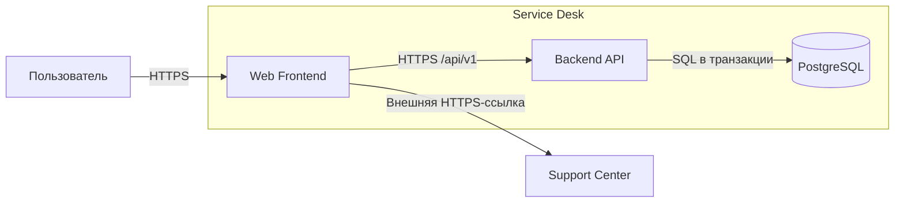

# Архитектура проекта

- Статус: В работе
- Владелец: Architecture Team
- Последнее обновление: 2026-07-29

Service Desk использует трёхслойную архитектуру: браузерный фронтенд отвечает
за пользовательский интерфейс, backend API выполняет бизнес-правила, а
PostgreSQL хранит обращения. Внешний Support Center остаётся за границей
управляемой системы.

## Контекст

Пользователь работает с Service Desk через браузер. Фронтенд обращается только
к публичному HTTPS API и не получает прямого доступа к базе данных. Backend
проверяет запрос, сохраняет обращение и возвращает результат, пригодный для
отображения в интерфейсе.

## Основные компоненты

| Компонент | Ответственность | Интерфейсы | Статус |
|---|---|---|---|
| Web Frontend | Форма обращения, локальная проверка полей, состояния загрузки и ошибок | HTTPS API, ссылка на Support Center | В работе |
| Backend API | Серверная валидация, бизнес-правила, создание и чтение обращений | REST `/api/v1`, SQL repository | В работе |
| PostgreSQL | Надёжное хранение обращений и времени их создания | Приватное SQL-подключение только для Backend API | Запланировано |

## Границы ответственности

- фронтенд не принимает решений о сохранении и не формирует идентификаторы
  обращений;
- backend повторно проверяет все входные данные независимо от проверки в
  браузере;
- база данных не доступна из публичной сети и не содержит логики отображения;
- переход в Support Center не передаёт содержимое обращения внешней системе.

## Основной поток данных

1. Web Frontend принимает заголовок и описание обращения и выполняет быструю
   проверку обязательных полей.
2. Frontend отправляет `POST /api/v1/requests` в Backend API.
3. Backend нормализует данные и применяет `BR-CORE-001`.
4. Backend открывает транзакцию и сохраняет обращение в PostgreSQL.
5. PostgreSQL возвращает созданный идентификатор и время создания.
6. Backend отвечает `201 Created`, а Frontend показывает экран результата.
7. При ошибке валидации Backend отвечает `400 INVALID_INPUT`; запись в БД не
   создаётся.

## Данные

Основная сущность `request` содержит:

| Поле | Тип | Назначение |
|---|---|---|
| `id` | UUID | Стабильный идентификатор обращения |
| `title` | text | Краткая тема обращения |
| `description` | text | Описание проблемы |
| `status` | enum | Текущее состояние: `new`, `in_progress`, `closed` |
| `created_at` | timestamp with time zone | Время регистрации на сервере |

## Развёртывание

- Web Frontend публикуется как статические файлы за HTTPS reverse proxy.
- Backend API запускается в приватном сегменте и принимает запросы только от
  reverse proxy.
- PostgreSQL размещается в отдельном приватном сегменте; миграции выполняются
  до переключения версии Backend API.
- Пароли и строки подключения поступают из окружения и не хранятся в
  документации или клиентском bundle.

## Внешние системы

- Support Center принимает пользователя по внешней HTTPS-ссылке и не имеет
  доступа к Backend API или PostgreSQL.

## Связанные процессы

- [FLOW-CORE-REQUEST: Создание запроса](../flows/FLOW-CORE-REQUEST.md) —
  последовательность вызовов Frontend, Backend API и PostgreSQL.
- [FLOW-CORE-ENTRY: Маршрутизация с главной](../flows/FLOW-CORE-ENTRY.md) —
  выбор внутреннего сценария или внешнего Support Center.

## Ограничения

- внешний Support Center не входит в границы управляемой системы;
- пример описывает целевую архитектуру, но не содержит работающей реализации;
- высокая доступность, репликация БД и фоновая обработка находятся за рамками
  демонстрационного MVP.
