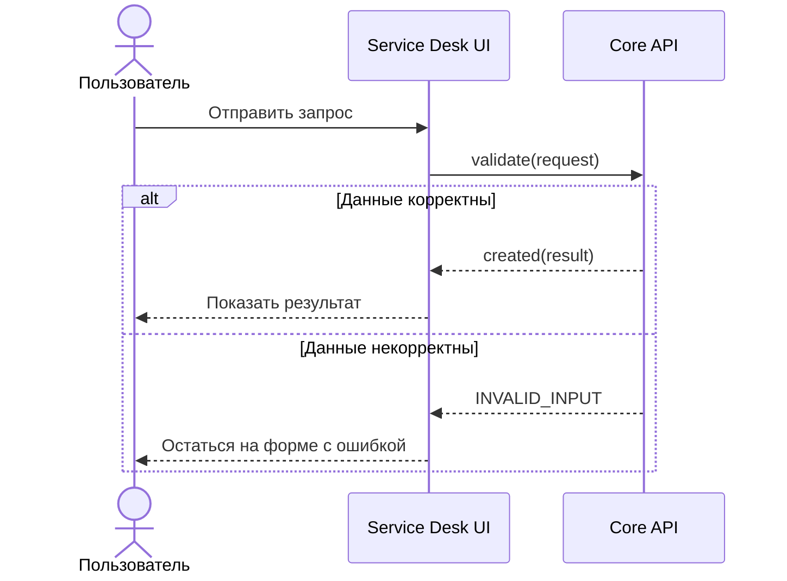

# Архитектура проекта

- Статус: В работе
- Владелец: Architecture Team
- Последнее обновление: 2026-07-29

Service Desk разделяет основной пользовательский интерфейс и внешний центр
поддержки. Эта страница также демонстрирует архитектурный `sequenceDiagram`.

## Контекст

Место системы и её окружение.

## Основные компоненты

| Компонент | Назначение | Статус |
|---|---|---|
| Client | Пользовательский интерфейс | В работе |
| API | Бизнес-логика | Запланировано |

## Потоки данных

1. Клиент отправляет запрос.
2. API обрабатывает запрос.
3. Результат возвращается клиенту.

## Внешние системы

- Support Center принимает пользователя по внешней HTTPS-ссылке.

## Последовательность запроса

## Ограничения

- внешний Support Center не входит в границы управляемой системы.
