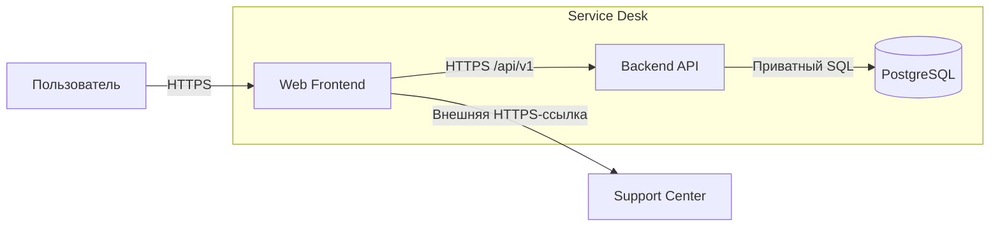

# Системный контекст Service Desk

- Тип документа: Architecture
- Архитектурный вопрос: Какие стороны взаимодействуют с Service Desk и где проходит системная граница?

Управляемая граница включает Web Frontend, Backend API и PostgreSQL.
Пользователь обращается к ней через HTTPS, а внешний Support Center получает
только отдельный переход пользователя и не участвует в создании обращения.

## Область

Контекст фиксирует стороны и крупные каналы связи, но не последовательность
создания обращения и не API payload. Они описаны в
[FLOW-CORE-REQUEST](../flows/FLOW-CORE-REQUEST.md) и
[API-контракте](../contracts/api.md).

## Внешняя сторона

Support Center не имеет доступа к Backend API или PostgreSQL. Смысл и правила
внешнего перехода принадлежат [MOD-SUPPORT](../modules/support.md).
