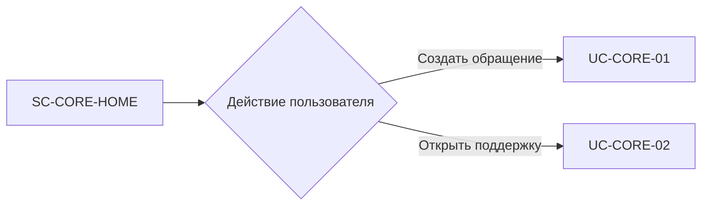

# FLOW-CORE-ENTRY: Маршрутизация с главной

- Идентификатор: FLOW-CORE-ENTRY
- Сценарий: UC-CORE-01, UC-CORE-02
- Модуль: MOD-CORE
- Последнее обновление: 2026-07-29

Переиспользуемый процесс показывает развилку между внутренним сценарием
создания обращения и переходом во внешний центр поддержки. Связь с двумя
`UC-*` демонстрирует двустороннюю модель процессов.

## Процесс

## Связанные документы

- [UC-CORE-01](../use-cases/core.md)
- [UC-CORE-02](../use-cases/support.md)
- [SC-CORE-HOME](../screens/SC-CORE-HOME.md)
