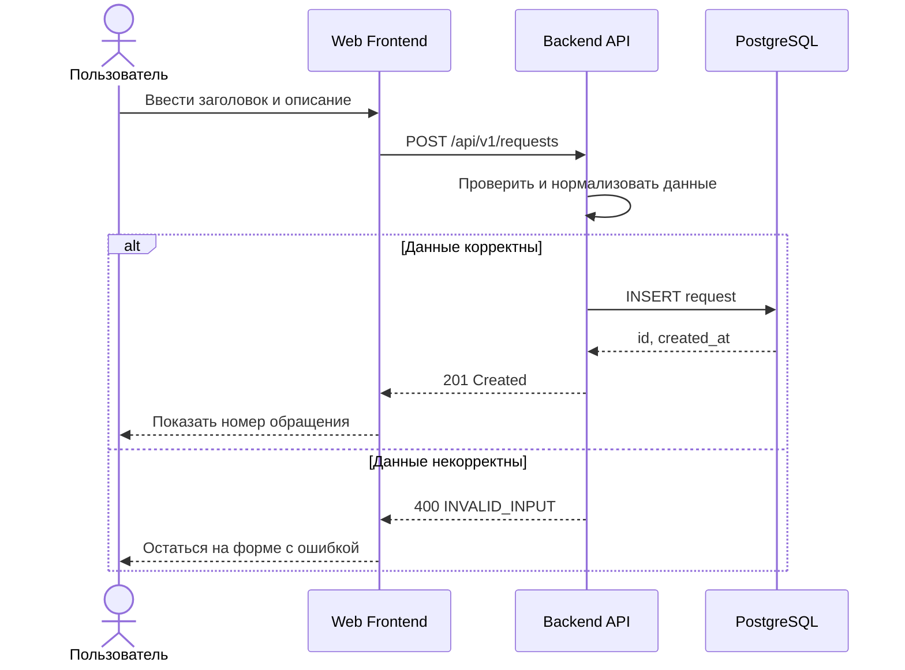
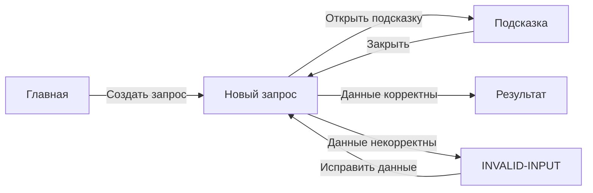
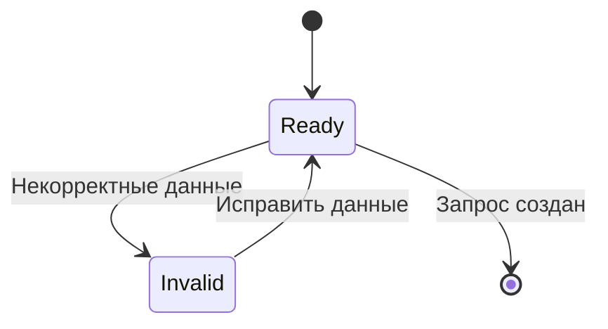

# FLOW-CORE-REQUEST: Создание запроса

- Идентификатор: FLOW-CORE-REQUEST
- Сценарий: UC-CORE-01
- Модуль: MOD-CORE
- Последнее обновление: 2026-07-29

Диаграммы визуализируют основной сценарий и состояния формы. Источником
переходов для Screen Map остаются документы `screens/SC-*.md`.

## Взаимодействие сервисов

## Процесс

## Состояния формы

## Связанные документы

- [UC-CORE-01](../use-cases/core.md)
- [SC-CORE-REQUEST](../screens/SC-CORE-REQUEST.md)
