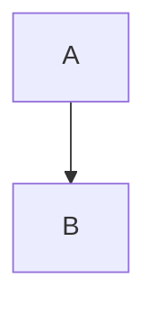

<!-- toudocu
id: PARITY-001
status: draft
-->

# Привет 😀

Описание с `кодом`, **жирным** и ~~зачёркнутым~~ текстом.

## Раздел 中

- [x] готово
- [ ] TODO

1. первый
2. второй

[ссылка](<https://example.com/a(b)> 'title') и https://example.org


| A   |   B |
| :-- | --: |
| я   |  中 |

```go
fmt.Println("hello")
```


