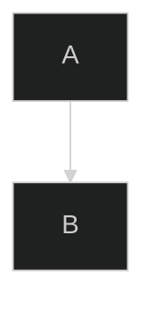

<!-- toudocu
updated: 2026-09-01
-->

# Active content fixture

<svg></svg>

<iframe src="https://example.test/frame"></iframe>

<xml></xml>

[active SVG](vector.svg)

```mermaid
%%{init: {"theme": "dark"}}%%
flowchart TD
  A --> B
```
