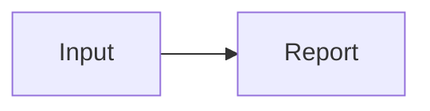

<!-- toudocu
updated: 2026-09-01
-->

# Architecture

The fixture keeps source Markdown separate from CLI reports.

- [Core module](../modules/core.md)
- [Compatibility use case](../use-cases/compatibility.md)

