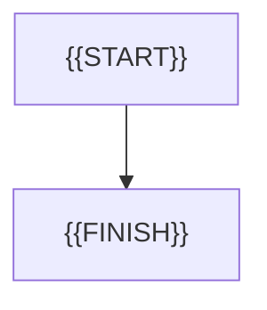

# {{FLOW_ID}}: {{FLOW_TITLE}}

- Identifier: {{FLOW_ID}}
- Use case: {{USE_CASE_ID}}
- Module: {{MODULE_ID}}
- Last updated: {{DATE}}

{{FLOW_SUMMARY}}

## Process

## Related documents

- [{{USE_CASE_ID}}]({{USE_CASE_LINK}})
